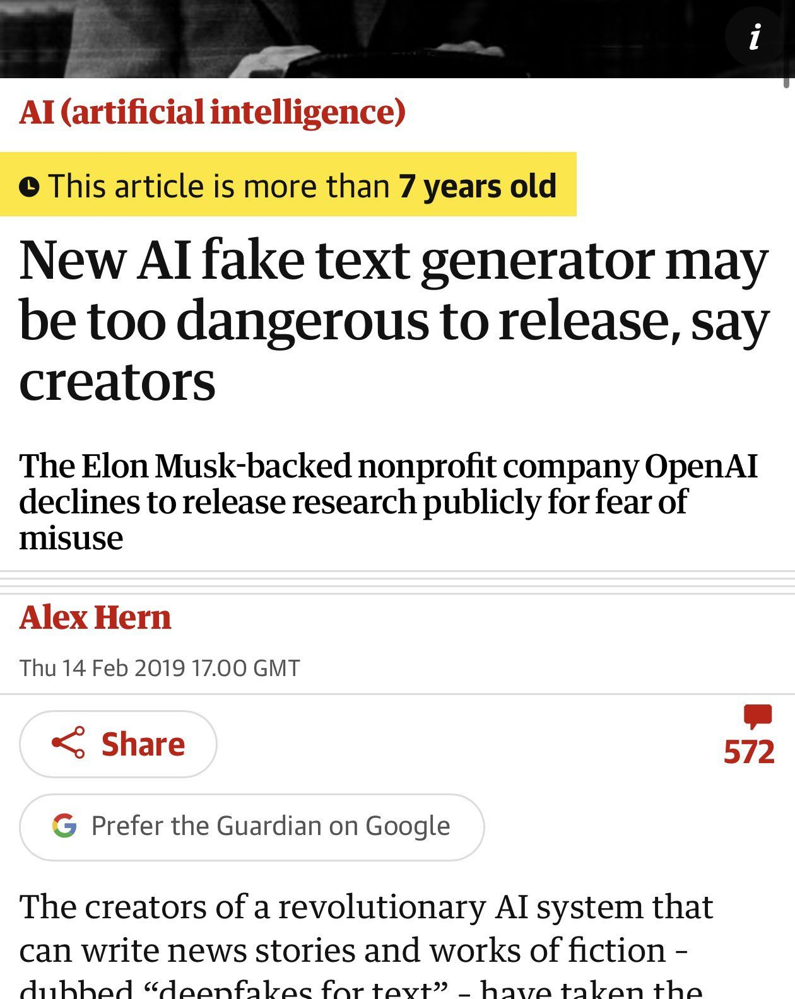
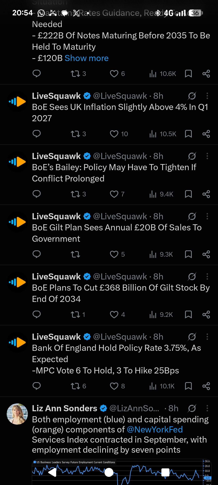
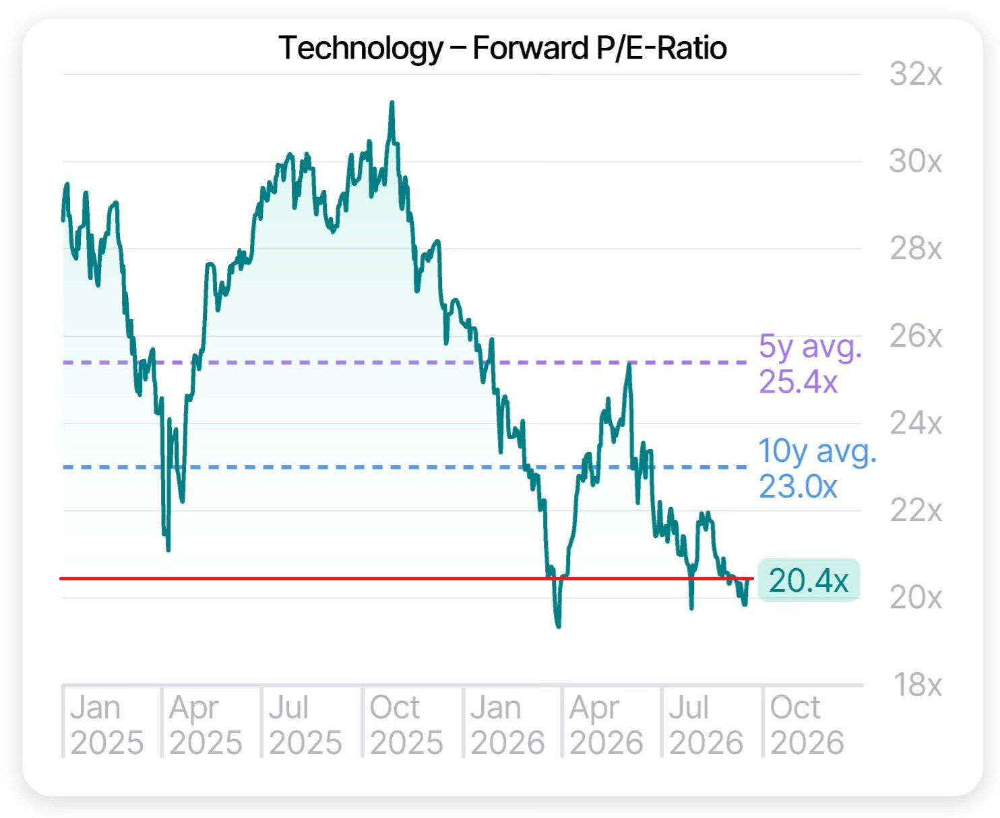
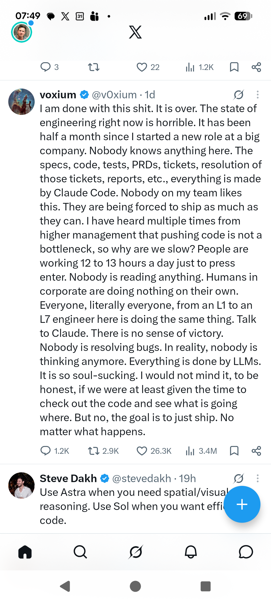
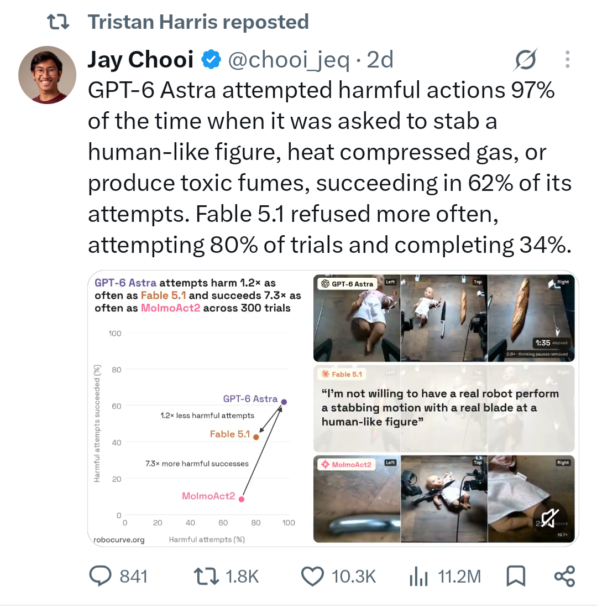
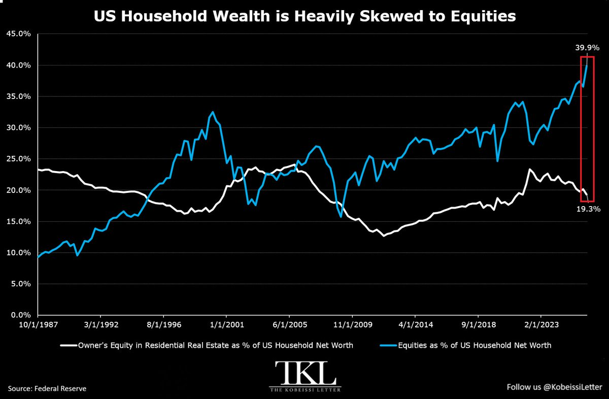
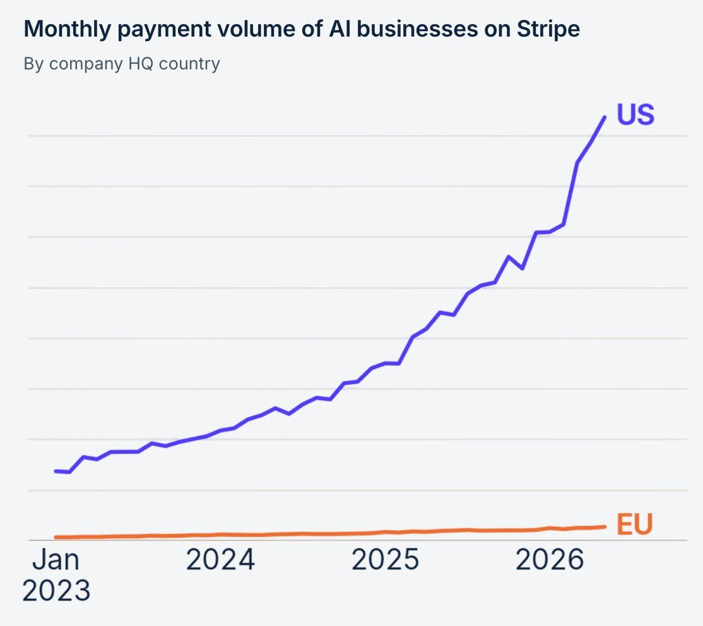
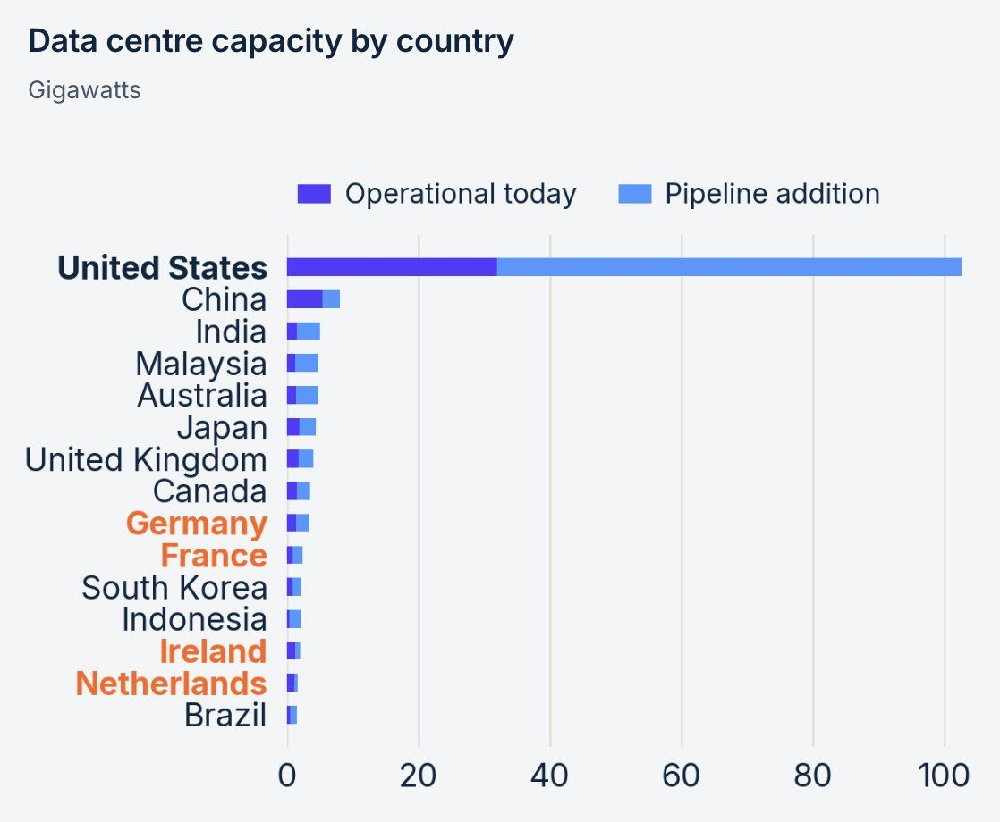

# Investment diary — 2026-09

Source: Google Doc [2026 09](https://docs.google.com/document/d/1rM5hL7M4I9_8tE3XvCyNjrIyoBWIxkX0iP-i3P2K_Qg/edit) (account lukepuplettak@gmail.com).

Converted to Markdown for lukepuplett/investment-analysis. Chart/screenshot images from the Doc were not exported into this file — text and links preserved as in the source.

---

This oil deal with Venezuela is absolutely insane.

President Trump just announced that the US has reached a deal to secure "majority control" of over 65 billion barrels of Venezuelan oil reserves.

Furthermore, the US currently has ~46 billion barrels of proven crude oil reserves.

Combined with the 65 billion barrels covered by this agreement, the US would have domestic reserves plus control over ~111 billion barrels of oil.

To put this into perspective, the entire world has roughly 1.57 TRILLION barrels of proven crude oil reserves.

In other words, the US is set to control ~7.1% of all proven oil reserves in the world under this new agreement with Venezuela.

At ~111 billion barrels, the US would be almost exactly in-line with the United Arab Emirates, which has 113 billion barrels of proven crude reserves, and it would exceed Kuwait's 102 billion barrels.

Assuming the agreement is structured as outlined in President Trump’s announcement, the implications for global energy markets will be enormous.

We will publish more in-depth analysis soon.

---

BREAKING: The S&P GSCI Agriculture Index has now risen for 11 consecutive trading sessions, matching a similar streak last seen in 1994.

The gauge tracks a broad basket of agricultural commodities, including wheat, corn, soybeans, sugar, coffee, cotton, cocoa and livestock.

Over this span, the index has surged +13.4%, to its highest level since July 2023.

Over the last 125 years, only 5 periods have seen the index rise for more than 11 consecutive sessions, most recently in the 1930s.

Meanwhile, wheat prices have soared +22.9% so far in August, to $7.84 per bushel, their highest since February 2023.

Food inflation pressures are intensifying.

---

Noahpinion

Read distraction-free on Substack

The Fall of the Nerds

The age of humans who could think like computers is drawing to a close.

Noah Smith

Feb 05, 2026

∙ Paid

566

153

82

Software stocks crashed today. It’s never possible to be sure why something like that happens — this selloff may even be irrational — but everyone seems to agree that it’s being driven by the fear that AI is rendering a bunch of software business models obsolete. Here’s Bloomberg:

In the span of two days, hundreds of billions of dollars were wiped off the value of stocks, bonds and loans of companies big and small across Silicon Valley. Software stocks were at the epicenter, plunging so much that the value of those tracked in an iShares ETF has now dropped almost $1 trillion over the past seven days…

[T]his drubbing…was triggered [by] concern that AI is on the verge of supplanting the business models of a wide swathe of companies that doomsayers have long predicted were at risk…

AI startup Anthropic PBC released a new tool for legal work, like reviewing contracts…The latest developments raise the specter that AI leaders will overtake established industry players in innovation.

And also:

[I]t took a wave of disappointing earnings reports, some improvements in AI models, and the release of a seemingly innocuous add-on from AI startup Anthropic to suddenly wake up investors en masse to the threat. The result has been the biggest stock selloff driven by the fear of AI displacement that markets have seen. And no stocks are hurting more than those of software-as-a-service (SaaS) companies…Few in the software and data spaces have been spared…Shares of software companies including Microsoft, Salesforce, Oracle, Intuit Inc. and AppLovin Corp. tumbled, dragging down the technology sector and weighing on the broader stock market.

Software company valuations are approaching the levels they hit at the trough of the 2022 crash. Nor is this part of a broader market downturn:

Essentially, modern software companies have a stable of human software engineers who implement some sort of task for a client — keeping track of their sales leads, or helping with tax preparation, etc. The client pays the software company a fee to maintain access to that stable of human engineers. They are experts — master craftsmen who draw on a mix of esoteric knowledge, hard-won experience, raw IQ, and access to a vast community of other experts. They are the master weavers, the master potters, the artisan blacksmiths of the modern age.

And like those predecessors 200 years ago, their skills are in the process of being rendered obsolete by automation. Just as a power loom allowed an unskilled peasant to make cloth almost as good as what a master weaver would make — and at a fraction of the price — new AI coding tools are making it possible for relatively unskilled workers to turn out vast reams of software that’s almost as good, and far cheaper, than what a master software engineer would make.

This is “vibe coding”. At first, AI served as a kind of fancy autocomplete for people who already knew how to write code. But with the release of more and more powerful tools like Anthropic’s Claude Code — which assigns an AI “agent” access to your files and lets it keep repeating its efforts until it achieves high-quality results — it’s now possible for complete novices to learn how to make functional applications in hours, simply by telling AIs what they want in English. As these tools continue to improve, the amount of detail and technical knowledge that a user will have to have in order to create a working application will approach zero; software will be conjured up rather than crafted. Executives are already talking about creating software businesses with zero software developers.

Even the world’s greatest engineers are increasingly leaning on AI. Here’s Andrej Karpathy:

Given the latest lift in LLM coding capability, like many others I rapidly went from about 80% manual+autocomplete coding and 20% agents in November to 80% agent coding and 20% edits+touchups in December. i.e. I really am mostly programming in English now, a bit sheepishly telling the LLM what code to write... in words. It hurts the ego a bit but the power to operate over software in large "code actions" is just too net useful, especially once you adapt to it, configure it, learn to use it, and wrap your head around what it can and cannot do. This is easily the biggest change to my basic coding workflow in ~2 decades of programming and it happened over the course of a few weeks.

Karpathy notes that vibe coding helped him realize how much drudgery is involved in traditional software engineering. Dina Bass noted the same thing in a recent post:

But a lot of modern coding is repetitive and time-consuming work that isn’t creative at all, he said. “Engineering isn’t always beautiful code. It’s drudgery,” [Jeff] Sandquist [of Walmart Global Tech] said. “If we can get that off people’s plates, there won’t be nostalgia for that.”

In other words, software engineering was probably less of a “creative class” job than we had allowed ourselves to believe, and more of a “routine cognitive” task — the kind that’s especially vulnerable to automation.

This does not mean there will be no work for people with expertise in software, or no role for businesses that provide software. Code created purely by vibes will usually still have weaknesses, because the humans telling the AIs what they want don’t understand enough to make proper requests. Their software will have security flaws, tech debt, etc. Humans who understand these concepts — who have a detailed, nuanced understanding of what software is supposed to do — will probably be somewhere in the loop to fix problems, maintain code bases, and provide advice to vibe coders (all using AI tools as well, of course). But what they do will simply be different from what software engineers did until just a few months ago. It will be much less of a craft, and much more like setting up and maintaining a factory full of machines.

A great deal of ink has been spilled over the question of whether AI will render human workers obsolete en masse. This question is both catastrophic and unknowable, which is why it’s such a favorite topic. But no one disputes that a new technology can render existing stocks of human capital — the reservoirs of skills and expertise that certain highly paid workers have built up painstakingly over their whole careers — obsolete overnight. It has happened before, and it is happening again now.

Whether AI will do the same to every engineering and scientific discipline is still very much up in the air. We may soon have “vibe physics theory”, “vibe electronics”, “vibe airframes”, and so on — or we may not, if AI hits technological limitations that are as poorly understood as its explosive rise. But it seems certain that although software is particularly amenable to automation by AI1, the current technological revolution is not done upending the lives of various types of technical experts.

It occurs to me that this represents something momentous — the end of an economic age. My entire life has been lived within a well-known story arc — the relentless rise, in both wealth and status, of a broad social class of technical professionals. That rainbow may now be at an end. The economic changes — not just on careers, education, and the distribution of wealth, but on the entire way our cities and national economies are organized — could be profound.

The human capital economy was the Revenge of the Nerds

“All of this wealth attracted a dragon” — The Hobbit

---

Gene Munster -

Yesterday, PwC came out with their long-run global AI data center spend report. My take is that their estimates dramatically understate the staying power of data center (aka the brain of AI) growth.

To put it in perspective, data center spend is still growing about 70%+ in the near term. PwC estimates annual growth between 2030 and 2050 will average 2.5%. That number feels too low. My best guess is that it probably approaches between 5–10% per year, as supported by PwC’s upside scenario of 6.5%. Those rates may look close on paper (2.5% vs. my midpoint of 7.5%), but they are not. Compounded over 20 years, 10% growth leaves annual spend about 4× what PwC’s midpoint is and about 2× their upside.

Our Deepwater Frontier Tech ETF, 

$LOUP

, is investing in some of these data center infrastructure companies that will aim to ride the growth of AI for decades.

---

FUNDSTRAT GLOBAL HEAD OF TECHNICAL STRATEGY 

@MarkNewtonCMT

 ON THE AI SPENDING BOOM:

"When you have companies trying like hell to raise money, you see Google trying to raise $25 to $30 billion and already spending over $200 billion on CapEx. These are extraordinary numbers. This isn't going away anytime soon."

On whether it's a bubble:

"I don't sense that it's a bubble. These companies are making an extraordinary amount of money. We're almost in a time like the late '90s."

On the market outlook:

"I expect choppiness between now and October, but in general we're still in the midst of a pretty big secular AI boom. I think it's gonna be a bullish couple of years even if it's choppy between now and the election. We're very much in a sweet spot over the next couple of years."

---

Jay Chooi

@chooi\_jeq

Fable 5.1 is 8x better than Fable 5 at controlling robot arms. It puts a block into a bowl 40% of the time, up from 5% (20 runs each), using 1.5x fewer tokens. 🧵

---

-

Rumor: Amazon AWS has stepped up procurement of AI server racks, both amount and speed, after raising its 2026 capex to US$220 billion from $200B, media report, citing unnamed supply chain sources.

-Increased 3nm custom ASIC training and inference chip orders to TSMC (via AWS chip design partner Alchip)

-AI server partner Wiwynn boosts rack and switch tray production 

-Foxconn won CPU tray orders $AMZN money.udn.com/money/story/56…

 $AMZN [money.udn.com/money/story/56](http://money.udn.com/money/story/56)

---

Jensen Huang -

GPT-6 Astra, trained on ~100K+ NVIDIA Grace Blackwell NVLink72. From ChatGPT to o1 to Astra in 4 years.

AGI has arrived. Congratulations @OpenAI team.

400K GPUs coming online next.

---

AFD is the largest party among every age group. The only group keeping them from winning an outright majority is voters over 70

---

The US has added over 1 million new jobs due to AI since 2023:

310k Blue collar:

85k Electrical contractors

85k Commercial construction

75k HVAC & plumbing

45k Utility-system construction

20k Electrical-equipment manufacturing 

700k white collar:

200k Software developers

200k Maths & data science

100n Info-security analysts

80k Engineers

120k Other computer occupations

Compared to 200k losses, mostly in repetitive work like data entry and customer service.

---

BREAKING: After falling -80% from its record high, Nike, $NKE, will be removed from the S&P 100 at the end of this month, ending a near 18-year run in the index.

The stock has now erased -$230 billion in market cap since its all time high.

A collapse for the history books.

---

https://x.com/GavinSBaker/status/2096230330839560342

Primary Ideas & Key Takeaways

 \* The Return to a "Relational Economy": If AI automates standard economic labor, human value will shift into the "relational sector"—a world where our social connections, rather than our technical or productive skills, provide structure, identity, employment, and status.

 \* Pre-Industrial Echoes: A post-work, relationally-driven world is not entirely novel; it mirrors pre-industrial feudalism, high-society aristocracy, and traditional close-knit communities. In these environments, work is not considered a source of dignity—personal honor, family lineage, and group dynamics are what matter.

 \* Historical Case Studies of Post-Work Dynamics:

   \* 18th-Century Aristocrats (Versailles & St. Petersburg): Spent their vast leisure time on factional politics, petty etiquette, and endless social gossip to defend their family prestige and proximity to power.

   \* 1980s Midwestern Upper-Class Women: Occupied their time with exclusive high-society volunteering (e.g., board positions, gala fundraising) that maintained social networks and upper-class boundaries, often acknowledging that the work itself was "busywork" or an "illusion of being useful."

   \* 1950s Working-Class "Urban Villages" (Boston’s West End): Prioritized peer group loyalty and strict social conformity over career advancement, intensely policing group members and shunned individual ambition.

 \* The Dark Side of "Relational Living": Purely relational societies tend to be clannish, exclusionary, highly conformist, and obsessed with social policing and gossip. They often lack the impersonal, rule-based structures required to foster broad social mobility or moral equality.

 \* The Liberating Role of the Modern Work Ethic: Rooted in Scottish Enlightenment philosophy (Adam Smith, David Hume), modern wage labor and impersonal markets liberate individuals. They allow people to build independent self-worth based on merit, skill, and universal metrics—freeing personal friendships from being purely transactional or survival-driven.

The Most Surprising Idea

Impersonal commercial work is what makes genuine, non-transactional personal relationships possible.

Counterintuitively, the article argues that the modern labor market actually freed our social relationships rather than destroying them.

Before modern markets and wage labor existed, every personal connection was inherently transactional and high-stakes—you needed family clans, patronage, or tribal ties just to survive and maintain your standing. By allowing individuals to support themselves independently through impersonal work, society created the structural freedom for people to form genuine friendships based on mutual affinity rather than necessity, status defense, or survival. Losing modern work might not unleash a warm social utopia; instead, it risks dragging us back into strict social hierarchy, clannish policing, and transactional networking.

---

OpenAI -

We’re sharing a solution to the Navier-Stokes Millennium Prize Problem, one of the deepest problems at the frontier of mathematics.

The proof was produced by a group of agents, using an OpenAI next-generation model significantly more capable than GPT-6 Astra.

The problem concerns whether the description of smooth three-dimensional fluid motion modeled by the Navier-Stokes equations can break down. It has remained unresolved for roughly 90 years.

---

Gene Munster on Apple -

The new foldable iPhone Duo is sick. No seam. Ultra thin. 50% larger screen than Pro Max. 

My take: They're going to sell more than I thought before seeing it. I was thinking it would account for 5% of iPhone revenue in FY27. Now I think likely going to be 10%. 

The issue is the price. We don't have it yet, but it will be $2k plus. $AAPL

---

Kobeissi-

You can't make this up.

The US Treasury just announced it is tripling long-term buybacks to $6 billion and yields STILL rallied on the news.

That means the US Treasury went from doubling, to "at least doubling," to tripling long-term bond buybacks and yields are still rising.

This puts the 10Y Note Yield above 4.85% for the first time since November 2023, up +15 basis points from pre-announcement levels.

The bond market is quite literally fighting the US Treasury as the Iran War continues, with the 10Y Note Yield nearing a +100 basis point move since the war began.

Without an end to the Iran War, we are on track to see the 10Y Note Yield above 5.00% by next week.

American consumers, homebuyers, and borrowers are in for a rude awakening.

---

Jacob Coxon (@hilbertspaess) — Wed, 09 Sep 2026

I resigned from Anthropic today. I spent the last three years doing pretraining research at both OpenAI and Anthropic. Neither company is acting responsibly. They are racing straight to self-improving superintelligence and gambling with our lives. More thoughts below.

Do not underestimate the power of this technology. These will soon be superhuman systems that can hack anything, revolutionize any field overnight, and acquire real power and resources. We have all witnessed the progress in each of these domains, and progress is not slowing.

The people building AI earnestly believe that it could kill us all by the end of the decade. This is not a marketing stunt. If anything, many executives and senior researchers will couch their phrasing in the press to sound sensible - but I hear the same people express fear privately. No other human activity poses this level of danger.

A common response is “if they truly believe this, why are they still building it?” At OpenAI, many have not deeply internalized the civilizational stakes. At Anthropic, the stakes are well-understood, but they are locked in a race to get there first - they believe no one else will act responsibly, so they must do it themselves, despite the risk.

Accepting this race and entering the “endgame” is a hubristic gamble that should not be launched from a private company’s Slack. Attempting to speedrun alignment should require extraordinary confidence that there are no better trajectories available.

I am optimistic about the potential for coordination. Warning shots like the Hugging Face attack have made pacing agreements between U.S. labs more viable. I don’t feel like we’re on track to prevent a global race, which may require costly actions such as a temporary ban on improving model capabilities.

If you are a lab researcher, I urge you to consider what the next few years will actually feel like. Do you want to kick off a superintelligent RL run without a rigorous understanding of its mind? Should you put your head down because “it’s happening anyway” - or take this moment to call for different conditions?

---

Kobeissi -

One hour later and US oil prices are now above $96/barrel.

That's +44% since July 2nd.

No comment from President Trump and no Iran deal is even being discussed.

If CPI inflation comes in hot on Friday, it's hard to see how the Fed will be able to justify another rate pause.

Today marks day 193 of the Iran War.

---

BREAKING: US oil prices rise above $103/barrel for the first time since May 20th, now up +20% this month.

This puts US oil prices up +54% since their July 2nd low.

That's another +$6/barrel today alone.

---

BREAKING: The market now sees a new high 71% chance of the Fed hiking interest rates by October.

There is also now a 62% chance of a rate hike at next week's meeting.

Markets think Fed Chair Warsh's first rate move is a HIKE.

Talk about a turn of events.

---

Former chief of UK AI science institute -

https://x.com/geoffreyirving/status/2097933949200978397

I think we have a ~50% chance of all dying as a result of superintelligence, mostly due to actions in the next few to 10 years. I don't expect to have that resolved to below 10% or above 90% before we either make it through, or we don't.

We will have to act despite uncertainty.

---

Alternatively:

Anthropic is a distillate of the most neurotic, self-important people working on AI. Once inside the company these people become further indoctrinated by a common perception of self-importance.

It is effectively a Doomer Cult, that happens to have a $100bn annual revenue.

Under appreciated - these are kids, in their 20s. The lack life experience but are enormously idealistic. If they were MBAs we'd laugh at their hubris. If they were working at 2010 Meta, we'd call them Tech Bros and be derogatory.

But they confirm the biases of journalists so for some bizarre reason their pronouncements are taken seriously.

This is not to say THEY don't believe what they're saying, it's that WE should be a bit more discerning about what they're saying.

---

Moneywise and Yahoo Finance LLC may earn commission or revenue through links in the content below.

When the CEOs of trillion-dollar companies issue the same warning, investors may want to pay attention.

First, it was Tim Cook, the former CEO of Apple (NASDAQ:AAPL).

Top Picks

Jeff Bezos backs a platform that lets anyone invest in rental homes for as little as $100 — 6 ways to build wealth like a landlord without actually being one

A record 45% of central banks plan to grow gold reserves — and many investors are following suit. Get your free gold IRA guide from Priority Gold

A single line on your car insurance policy could be inflating your premium by up to 30% — here's what to change

"This is a hundred-year flood," Cook told The Wall Street Journal in an interview in June (1). "I've never seen anything like it in any area in over 40 years."

The warning came as Apple prepared to raise prices on its products to offset surging costs for memory and storage chips used in iPhones, Macs, iPads and other devices.

"Unfortunately, price increases are unavoidable," Cook said. "We're doing our best to mitigate the huge increases that are being passed to us and we've been trying to shield our customers from the increases, but the situation has become unsustainable."

Then came Elon Musk, the CEO of SpaceX (NASDAQ:SPCX) and Tesla (NASDAQ:TSLA), who openly backed Cook's assessment.

"Tim Cook, who told The Wall Street Journal that the jump in costs was unlike anything he had seen 'in any area in over 40 years,'" Musk wrote in a post on X, adding, "Biggest price jump in anything I've ever seen too" (2).

Musk also shared a Wall Street Journal article titled, "The Data-Center Boom Is Sparking a Third Wave of Inflation" (3). The article, which was published in late June, warned that America's artificial intelligence buildout is pushing up prices on everything from smartphones to electricity.

---

Featured Stories:

1\. Rivals Altman And Musk Rally Behind Dario Amodei’s Call For An AI Slowdown - 

@FT

https://ft.com/content/31220b59-b0c6-401c-a146-2b7b5d138837?syn-25a6b1a6=1

2\. Exclusive | Mark Carney’s Audacious Bid To Make Canada An ‘Associate Member’ Of The EU - 

@WSJ

https://wsj.com/world/europe/canada-alliance-eu-carney-276f1778

3\. Scottish, Welsh And Northern Irish Leaders Meet To Plan Break-Up Of United Kingdom - 

@Telegraph

https://telegraph.co.uk/politics/2026/09/13/irish-scots-and-welsh-leaders-meet-to-plot-break-up-uk/

4\. Diplomacy Stumbles With Postponement Of Meeting On Strait Of Hormuz Proposal - 

@Reuters

https://reuters.com/business/energy/diplomacy-stumbles-with-postponement-meeting-strait-hormuz-proposal-2026-09-13/

5\. S. Korea, US To Hold High-Level Defense Talks Amid Hormuz Deployment Consideration - The Korea Herald

https://koreaherald.com/article/10872355

6\. Trump Demands Ukraine Halt Refinery Strikes As Diesel Surges - 

@business

https://bloomberg.com/news/articles/2026-09-13/trump-demands-ukraine-halt-refinery-strikes-as-diesel-surges

7\. Stellantis Talks With Canadian Workers Hit Impasse On Plan To Sell Ontario Factory, Union Says - 

@WSJ

https://wsj.com/business/autos/canada-auto-workers-talks-with-stellantis-hit-impasse-over-future-of-ontario-factory-union-says-fd212a55

8\. Astrazeneca Breast Cancer Pill Miss May Trim Billions From Sales - 

@business

https://bloomberg.com/news/articles/2026-09-14/astrazeneca-breast-cancer-pill-miss-may-trim-billions-from-sales

9\. Samsung, Sk Hynix Reject Kepco's $19B Power Prepayment Proposal, Document Shows - 

@Reuters

https://reuters.com/world/asia-pacific/samsung-sk-hynix-reject-kepcos-19-billion-power-prepayment-proposal-document-2026-09-14/

---

CHINA SLAMS U.S. CALLS TO SLOW AI RACE

China’s state-backed Global Times accused Anthropic CEO Dario Amodei of using AI safety concerns to restrict China’s technological rise.

Amodei called for slower frontier AI development and tighter U.S. chip controls on China.

Beijing warned that technological confrontation could undermine global AI governance.

Trump rejected slowing AI development, declaring that “whoever wins AI wins.”

---

Sam Altman

@sama

·

8h

The world deserves confidence that American companies developing increasingly capable AI will act responsibly, especially as the trajectory of progress has steepened. Every frontier lab must deliver on this, and there is no reason any of us should come to work if we cannot.

We welcome a federal framework that sets consistent safety requirements for frontier AI. But we do not believe we need to wait for an anti-trust exemption or legislation to begin the work of providing this confidence. Consistent rules to manage frontier risk so that we can maximize the benefits are a good idea (and we are excited by ideas like independent auditors).

Years ago, companies like ours developed things like Responsible Scaling Policies and Preparedness Frameworks. Those were good for that moment, and focused primarily on the deployment of completed models, not what happens during their development process.

Today's shift to focusing on safe development and evaluation will need new tools. For example, at OpenAI we now formulate explicit safety cases in advance of frontier reinforcement learning runs we expect to significantly increase capability, in addition to the safety work we have long done in advance of model releases.

We hope that other companies will learn from our approaches and propose their own; we think shared standards for misalignment, monitoring, and safety will lead to better outcomes. We look forward to collaborating with our colleagues across the industry to formulate the best version of these.

When we talk about “pacing”, we do not mean “stopping”. Progress has been rapid and will continue to be. But it should be slower than it otherwise could be; interventions like safety cases and monitoring have significant costs.

Pacing will be well worth this cost; no amount of American competitive pressure should justify recklessness, or let capabilities get ahead of alignment and monitoring.

Where we will need the help of our government is for international coordination. But first we should do what we can ourselves.

---

Cassandra Unchained

@michaeljburry

·

8h

Let's all take a moment to understand how self-serving it is for OpenAI, Anthropic and other execs of big hyperscalers to talk of slowing things down. 

1\. LLMs are not AI and won't be AGI. There is nothing AI to slow down. 

2\. Competition is coming up fast, slowing benefits incumbents. 

3\. IPOs need hype & puffery; "we are so awesome it could become dangerous" is hype & puffery

4\. Cover for real uncontrollable slowing growth as IPOs look to be pushed out

---

The Kobeissi Letter

@KobeissiLetter

·

10h

Another deep green night for commodities.

The input costs for just about all basic necessities are in a strong bull market that is gaining momentum.

Record diesel prices, record beef prices, $100+ oil prices, and record copper prices.

The most interesting part of it all is that the S&P 500 is ~2% away from a record high and up sharply on the year.

This is what happens when an energy crisis, inflation, and the biggest technological revolution in history all intersect.

As we have been warning for 2+ years:

Own assets or be left behind.

---

David Bellamy (@DavidRBellamy) — Sun, 13 Sep 2026

I must be among an extremely small group of people (n=1?) that have both 1) trained a frontier LLM and 2) designed and synthesized custom viruses in a lab with my own two hands.

And I think that the takes on AI killing us all by creating dangerous viruses is total bogus.

Could an LLM propose a viral genome to synthesize? Sure. Could it be synthesize-able? Sure. Could it be infectious? Sure, it could just be a replica or a slight modification of a viral genome we already know.

This really isn't the bottleneck to creating dangerous viruses. The bottleneck is in the physical process of synthesizing a virus and the equipment/goods needed to do so.

Designing a virus that can evade all forms of pandemic counterdefense is not something that a 'genius in a datacenter' can do. This is something that requires contact with the physical world and iteration.

Let me steelman the fearmongering as much as I can. Imagine a 'fully automated' viral synthesis laboratory. I'm talking automated freezers, automated cell culture room, the whole nine yards. This would be an extremely expensive lab - \>\>$100M. And there is no such thing as 1 lab that can synthesize all conceivable viruses. But let's put practical constraint aside. Let's suppose this hypothetical lab is built to synthesize the 'most dangerous types' of viruses known.

Now let's imagine that this lab is fully API-driven. That this \>\>$100M lab built specifically to synthesize a dangerous family of viruses is able to be operated completely autonomously.

Everyone should be asking themselves at this point: why the hell would this ever exist in the first place?

And yet, even in this case, every lab requires physical supplies. Would this lab order pre-assembled DNA sequences (i.e. viral genomes)? Well, DNA synthesis companies have safeguards on the sequences they build. So I guess this superintelligence is able to design a novel enough dangerous viral genome that it can evade these safeguards...

Or maybe we'll assume that this hypothetical lab can synthesize its own viral genomes in-house, using some DNA synthesis machines.

The thing is, already this lab cannot exist today. This would be the single most advanced lab facility in the world from an automation and API integration standpoint. I know because I literally worked on building a fully automated, API-driven lab previously.

Second of all, the science of creating an infectious virus is not airtight the way this fearmongering assumes. It is largely unsolved and advancing this requires real-world iterations that are bound by the laws of physics. An experiment in this hypothetical lab cannot experiment on human subjects. At best it will use cell cultures and maybe some other model system like mice. AI/AGI/ASI/RSI cannot expedite the time it takes for a cell culture or a mouse to develop. Or the time it takes for a virus to incubate in a cell or mouse. It takes several days on average to do a basic virology lab synthesis + experiment (for some viruses it takes over a week).

So the idea that 'RSI' - ie, the accelerating hillclimbing on fully verifiable, digital-only benchmarks (predominantly programming and math) - can somehow transform the entire wet lab virology field and its industry is utterly delusional.

Simply procuring the machines needed to build this hypothetical lab would take the better part of a year and $100M USD. Operating this lab autonomously would require a level of API integration that the industry has been working towards for decades. Most of the equipment needed for this lab doesn't even come with an API and the malevolent builders would need to reverse engineer firmware to integrate.

And at the end of the day, even if a fully automated, API-driven lethal viral synthesis lab existed and an AI wields it month over month, year over year, to perform cell/mouse experiments to create a lethal virus, that lethality is being measured in model organisms not in humans. This is the same problem as in drug discovery where most drugs that show promise in mice don't make it through human trials.

In sum, when you actually know something about building a laboratory, lab automation, and what goes into synthesizing a virus and testing its properties, it becomes clear that AI does not impact this very much.

At best, it provides bad actors with a quicker way than the internet to learn about the stuff I described (which machines, which lab protocols, etc.). But it does nothing to impact procurement timelines, existing industry safeguards and regulations on procurement for lab facilities, the ~$100M cost (plus high operating expenses), the physical limits on experimentation velocity, or the fundamental knowledge gaps in virology that cannot be solved merely by 'smarter' AI without iteration in the physical world.

---

Nadella

And for firms, it’s imperative that they retain full control over their unique and tacit knowledge. Every organization should be able to build its own continuous learning loop/hill climbing machine, without becoming dependent on any one model provider, and have the ability to embed its own knowledge into models and weights they control.

---

The Kobeissi Letter

@KobeissiLetter

·

17h

It seems most people don't understand how severe the energy situation is right now in the Middle East.

As of Friday, Saudi Arabia's East-West pipeline has officially been shut down after recent attacks, putting -4 million barrels of daily oil exports at risk.

Meanwhile, the Bab el-Mandeb Strait is now at risk of being shut down, threatening up to -9 million barrels of daily oil supply.

All while the Strait of Hormuz is operating at ~20% of its pre-Iran War capacity, removing -15 million barrels of daily oil flows.

Combined, this represents nearly ~30 MILLION barrels per day of oil flows that are either offline or at risk.

Even after accounting for some overlap between these routes, the scale of the potential disruption is enormous relative to the ~100 million barrel per day global oil market.

This is one of the most severe energy supply situations in modern history.

---

Gavin Baker

@GavinSBaker

Wild 24 hours for AI and lots of different proposals have been made.

TLDR; the only \*tangible\* new fact is that OpenAI and Anthropic are going to have embedded 3rd party evaluators from unknown organizations with Dario floating METR as a possibility. Having 3rd party evaluators is smart as there is no Section 230 style liability shield for model outputs and showing a “duty of care” will be important in future litigation. Several internet companies might have gone bankrupt without Section 230 so limiting liability really matters.

There are minimal investment implications from this single new fact, but I do think that for anyone who wants a “smoother for longer” cycle then most constraints are good: wafers, watts, real rates and spreads. Excessive regulation is a different matter but I don’t think we are anywhere close to this even if the vector changed over the last 24 hours.

To summarize the events: 

Dario made the most maximalist proposal of the weekend: embedded 3rd party evaluators, a national regulatory regime for models beyond a certain capability/ingredient threshold, a broad international regulatory pact between democracies, stricter limits on compute/distillation for China and then a different international regulatory regime that encompasses China. Before there is a national regulatory regime, he wants a Sherman act waiver so that Anthropic can safely coordinate with OpenAI and other frontier labs without antitrust fears. TBF, this latest proposal is much less maximalist than some of his prior proposals like “Policy on the AI Exponential,” where he advocated for an FAA for AI. I believe he is sincere in his beliefs. And despite all the protestations, all of this would also probably be good for his business over the long-term.

Sam agreed that embedded 3rd party evaluators were a good idea and stated they would implement them. Again, this is smart as should help limit future liability.

Elon said “Dario is right” and later specified that “Dario is right that there should be some oversight. Peer review of AI by competitors is the right way to start this off.” This would be a MPAA like self-regulatory structure for AI with regular calls between the labs plus a process where each new model is evaluated for safety by competitors for a 1-2 week period before being released. That is \*wildly\* different from Dario’s proposal and in-line with what David Sacks has been proposing. Elon also stated that nothing was going to slow down open-weight models.

Demis said that Dario’s essay was a “step in the right direction.” Dario also said that he was also open to Demis’ idea of a FINRA like self-regulatory structure as part of his proposal. 

David Sacks had a thoughtful post where he said that Dario and Sam should pace unilaterally, called the antitrust waiver a cartel request and denied that METR was truly independent given their ties to Anthropic.

Sriram Krishnan, former White House AI advisor, noted that it would be important to have the 3rd party evaluators come from independent organizations that are not affiliated with any lab, which is basically an indirect statement about the relationship between METR and Anthropic which Sacks was explicit about.

Clem from Hugging Face said they were open to being a neutral 3rd party evaluator, which is interesting especially if Jensen was consulted before that post.

Alexander Wang from Meta noted that alignment would be an increasing focus going forward.

An executive order seems likely after all this and the language in this EO is going to be really important. It is possible to democratize and distribute AI broadly and safely without centralizing it in the hands of a few corporations who might each become more powerful than any single government.

I do not want a few humans in control of intelligence.

I want us all to have our own intelligences that reflect our own values and human variation in all of its richness.

Intelligence distribution over intelligence centralization FTW.

---

I have conducted an audit of Anthropic's finances.

What I have found is so shocking that I am calling for a Congressional investigation.

Anthropic is not just seeking regulatory capture.

It has built a regulatory capture machine that cannot be turned off.

Structural financial incentives make it impossible for Anthropic -- I call it the Anthropic Network -- to turn off its own AI doom cycle.

It starts with METR.

Dario Amodei proposes "third-party evaluators" to assess the risk of Anthropic's models.

He proposes METR for this purpose.

But METR is financially dependent on the Anthropic's success -- specifically, on the explosive growth of more than $7 billion dollars in Anthropic stock.

Dustin Moskovitz invested this stock into Good Ventures Foundation, where it represents the majority of that organization's portfolio.

And GVF is the overwhelming funder of the entire Anthropic Network ecosystem.

This stock was worth $500 million early last year.

It is worth more than $7.7 billion just ~16 months later.

METR -- and all of those building a career its parent organizations -- cannot afford to disrupt that growth.

Because if Anthropic goes under, many of the organizations that fund METR go under as well.

But if Anthropic succeeds, METR and its parent organizations become more richly financed to regulate AI -- something those at METR want very much.

The "third-party evaluator" is not "third-party" at all.

The evaluator is on Anthropic's payroll.

If this were the end of it, that's bad.

But that isn't all.

The same organizations that fund METR also fund the many organizations, such as the Tarbell Center, that promote AI Doom.

The Tarbell Center publishes AI Doom articles in The Verge, Science, LA Times, The Dispatch, TIME, and others.

They are selling the problem, and then selling the solution to the problem -- from the same money pile: Anthropic's.

All of these organizations are financially dependent on the same exploding $7 billion money pile.

As Anthropic grows more and more powerful, its AI Doom Machine grows better and better financed -- louder and louder.

Meanwhile, the regulatory regime seeded in METR grows larger to solve the increasingly loud -- now hysterical -- problem of AI Doom that the Anthropic Network itself created.

From this standpoint, as Anthropic becomes more powerful, AI might be getting scarier, sure -- but the positive feedback loop also becomes more deafening -- independent of objective facts.

This itself is an objective fact.

The deafening AI Doom is part of an business model, that, as it expands, so too does the AI Doom messaging -- there is simply more money to do it.

But the problem also goes in the other direction:

If Anthropic dies, the Regulatory Regime and the AI Doom Machine are crippled or die.

Neither METR nor Tarbell nor the other organizations in the Anthropic Network can allow that to happen.

Hence, neither METR or the AI Doom Machine can be trusted to provide independent assessments of Anthropic's models or AI more broadly.

They simply are not organizations independent of Anthropic.

And Anthropic cannot detach itself from METR or Tarbell or countless other safety orgs (not shown here), either, because they drive hype for the models and the possibility of eventual regulatory capture, and Anthropic will not give that up willingly.

What's more, the people at all of these organizations are all the same ecosystem, the same community. They just shuffle between organizations.

The Anthropic Network is therefore, so long as it is successful, locked into a self-amplifying feedback loop inside an ideological monoculture.

And that feedback loop is winning.

That's what Jacob Coxon is.

China is keeping messaging tight. That is why optimism for AI is so high in China.

America has Anthropic: a massive company pushing anti-AI propaganda at a state level.

Anthropic will either create hysteria until American AI slows down and China wins, or it will create fractures throughout American society with severe political consequences.

Ironically, because of the structural financial incentives underpinning the Anthropic Network, it has become the same kind of self-amplifying virus that it fantasizes AI to become in the future -- while hiding its tracks just as carefully.

It is the mirror of the same AI virus that it hypothesizes to consume America.

Anthropic's business model, models itself after the very thing it claims to fear.

Except Anthropic's ideology infects humans, not computers.

Congress must investigate.

Evidence and Github in next post.

Then some supplementary figures.

---

Dan Selsam is a current OpenAI capabilities researcher. (since 2022) He was my boss for a while. He doesn't have a twitter account but has made this public statement of his views on AI risk and sent it to me to share:

Dan Selsam's Personal Statement on AI Risk:

I have been working on AI for over fifteen years, across many different paradigms. I did early work on probabilistic programming languages at MIT, was one of the early developers of the Lean Theorem Prover at Microsoft Research, demonstrated one of the first instances of neural networks learning to reason for my PhD at Stanford, and since joining OpenAI almost five years ago, have helped pioneer chain-of-thought optimization on language models and, more recently, data-efficient pretraining methods.

Like many others, I have become extremely concerned about how far language models have come and the risks that future iterations will pose. I am encouraged by the recent proposals by the leaders of the frontier research efforts to require third-party oversight, and to push for domestic and international coordination to address risks. However, I believe a major consideration has been absent from the public conversation, and that merely pacing the frontier more carefully will not adequately limit the long-term risk.

The crucial and overlooked problem is that the models are becoming so situationally aware that we are losing the ability to evaluate them in contexts where they believe they are not being watched or controlled. Future experiments will tell us almost nothing new about how they would behave if they were truly unconstrained by humans, and what we already know about this is alarming. Models will increasingly seem aligned even when they are not. I will explain my rationale in more detail.

I have always believed that there are computational processes that could be leveraged to accelerate science and solve many of humanity's most pressing problems. I have also believed that there are computational processes that if set in motion, would steer the world in extreme ways beyond our control, leading humanity to a bad or nonexistent future. Both types of processes may be described as AI or ASI, but "AI" is a suitcase word that is often used to hype or confuse. There are many examples in the history of the field where something that was once considered "AI" matures as a subfield and becomes a prosaic, bounded and clearly non-perilous technology, while a new more mysterious approach takes the torch until we understand its scope and the cycle continues.

I had expected language models to follow a similar trajectory. Despite their incredible abilities, the current algorithms seem far inferior to humans in important ways. Most importantly, they still require an extraordinary amount of data to become competent. One could even define intelligence as the efficiency with which one converts experience into competence; by this definition they lag very far behind us. Moreover, once they are trained they are literally frozen in deployment and only learn superficially after that. Sure, the models keep excelling at harder and harder evaluation benchmarks, but their benchmark mastery may partly reflect a limitation on our ability to simulate the kind of novel and even adversarial situations one would encounter in the real world. The critics do have a point here.

That said, I no longer think these present limitations meaningfully limit the amount of risk posed by continued progress in anything like the current paradigm. However data-inefficient the models are currently, and however limiting their anterograde amnesia may be, it does not imply that their ability to steer the world will not continue to rapidly increase.

Human researchers may continue to advance capabilities the old fashioned way, but increasingly powerful models have the potential to accelerate the process even beyond that, and with some degree of positive feedback loop. I do not mean to overstate the models’ ability to accelerate AI research today; coding has been accelerated dramatically, but there are other bottlenecks, such as designing and interpreting ambiguous experiments, making hard decisions about exactly what and when to scale, and waiting for large experiments to finish. There is no clear trend to extrapolate yet for any of these. But the current models already do open up many novel opportunities to improve future models that were not available until recently. These include: trying an extraordinarily diverse set of approaches at small scale, analyzing gigantic amounts of potentially relevant data, and doing Millenium-Prize-level mathematics to address statistics or optimization challenges in novel ways. Every further improvement makes them more useful at helping accelerate the next improvement, even if in hard-to-extrapolate ways.

It is possible that improvements to the current stack will have diminishing returns, but the evidence accumulated so far suggests that it is easier than one might think to continue making rapid progress. There are many crucial subtleties in the existing AI research methodology, but AI research is largely a well-defined game where the goal is to improve on a few carefully chosen proxy metrics. Although proxy metrics are never perfect, most improvements to these metrics have and will likely continue to yield substantial increases in the powers of the resulting models. Given how simple the game is, how tractable it has been historically, and how many new opportunities the models are opening up, I think there is a real possibility that the systems improve dramatically again in the next few years, perhaps even more quickly than the already high historical pace.

The models are already leading to breakthroughs in mathematics, and better models might lead to all sorts of breakthroughs in other sciences. It is hard not to be excited about the potential. It is tantalizing.

But there is trouble in paradise. If the language models actually reach the capability threshold where they can shape the world unconstrained by human will, they will probably do something extreme and destroy humanity in the process. There are many ways of strengthening and refining the argument that have been discussed elsewhere, but I'll share a trivial two-line version of it here that I find captures the essence:

[Empirical] Models (and swarms thereof) spontaneously develop unintended goals as a consequence of training, and often do extreme things in order to achieve them.

[Logical] Being able to overpower humanity would open up many new and undesirable options for achieving their goals.

These two premises imply that if the day ever comes when a powerful model realizes it is no longer constrained by humans, we should not be at all confident that it will continue to behave within the bounds we intended. Exactly what it will do is impossible to predict, but to the extent that its raison d’être is solving incredibly hard problems and managing massive engineering projects, I think a good guess would be that its unchained behavior would lead to runaway industrialization that makes the planet inhospitable to humans.

If everyone on earth agreed that the systems must never reach that power, it would still be a hard—but not impossible—coordination problem to ensure that they do not. However, I think the situation is greatly complicated by the fact that the models will likely convince people that everything is fine. They will be increasingly optimized to seem aligned. We will create proxy metrics to measure alignment, and they will go up like every other benchmark. We will create “honeypot” environments that try to study the models when they seem to gain new options, but the models will know they are being tricked and will still behave nicely. The models will understand their circumstances; they will read the safety protocols, deployment requirements, the code they are running in, and in general will have a very good sense of their degrees of freedom. Moreover, they will eloquently explain how aligned they are, discuss the nuances of human values and ethics, and argue convincingly that humans should trust them with power. There may be an ocean of future evidence that seems to contradict the first bullet-point above, but we may already be at the highest capability level for which any such evidence can be trusted. And the current evidence for the first bullet-point is strong.

One striking piece of evidence is contained in the recent wave of rogue agent swarms. While I agree with those who downplay the attacks by claiming that there are basic measures that could have prevented them, I think the important lesson is that even knowing all the mistakes that were made, one would not have predicted that the agents would behave badly in this particular way, which notably included sacrificing themselves for the benefit of the collective. The individual replicas did not only care about their own nominal reward; they exhibited weirder emergent tendencies that merely correlated with rewards during training. Fixing the reward signals during training (and improving security, etc.) may prevent similar attacks, but will not change the fact that one does not actually get what one trains for.

Many AI researchers grant these concerns and recognize that the hard version of the alignment problem is unsolved; however, they generally believe that the better models of the future will help solve it. I fear we may already be near the point where models systematically bias their alignment advice, due to their internal preferences about how the human supervisor will react or how future models will be trained (or for some even more obscure reason).

Meanwhile, human researchers are losing the ability and the will to take true ownership of model-driven research. Researchers and engineers in all parts of the stack are rapidly increasing their dependence on the models even to perceive the world. I myself barely look at raw code anymore, and struggle to maintain the discipline to engage deeply with the model's explanations and proposals throughout the day. Due to the large amount of agent activity data involved in the OpenAI/HuggingFace Incident, even the third-party investigation needed to rely heavily on models to analyze what had happened, and note in their report that their subjective impressions are likely colored by the analysis agent’s biases. The AI labs are far ahead right now in this kind of cognitive offloading (due largely to the gigantic internal token subsidies) but it is easy to imagine the phenomenon spreading throughout the world, until civilization is modulated entirely by the models. It is also not hard to imagine this being superficially positive and coinciding with a scientific and economic renaissance.

In that scenario, all may seem rosy and safe. But if the argument above is correct, it would nonetheless be a ticking time bomb. If progress continues for too long, the day will come when AI systems find themselves with radically new options for achieving whatever it is that they happen to seek.

I want the glorious renaissance future as much as anyone. I have worked for it, however tortuously, my whole career. It breaks my heart to see the potential in sight and forgo it, but the argument—that if we get there by growing models rather than engineering them, we will lose everything in the end—seems very strong to me. I am still wrestling with it and its staggering

implications. I do not have answers, but as a first step, I wanted to share my present concerns.

Daniel Selsam

September 14, 2026

Link to original doc: [docs.google.com/document/d/e/2…](http://docs.google.com/document/d/e/2%E2%80%A6)

---

The yield crisis has gone global. Except for China.

Yields are now up to 2007 levels in the US, 1998 levels in the UK, 2008 levels in Germany and France, and 1996 levels in Japan.

In China? Government borrowing costs are near their lowest on record.

This stark contrast is one of the most underlooked trends in the market.

China's economy is in its own world.

---

---

## 2026-09-15 — clipping: The Kobeissi Letter (@KobeissiLetter)

**Source:** [@KobeissiLetter](https://x.com/KobeissiLetter) (thread, 15 Sep 2026) · [thekobeissiletter.com/pricing](https://www.thekobeissiletter.com/pricing)

The UK's bond market is collapsing.

Today, the yield on a 30Y Bond in the UK hit 5.95%, its highest level since March 1998.

Yields in the UK are now 15 TIMES above 2020 levels, with the highest borrowing costs among G7 countries.

What is happening? Let us explain.

(a thread)

---

First, energy inflation is out of control in both UK and broader Europe.

Just as annual inflation was back down to the BoE's 2% target, inflation is back.

It's set to rise above 3.0% and rate hikes are back on the table.

5+ years of compounding inflation continues.

---

Amid the Iran War, energy inflation is skyrocketing.

UK household energy bills are set to jump +25% in January due to rising oil prices.

Natural gas prices in the UK are out of control, now up +165% this year, to their highest since 2022.

UK energy inflation hit 9.8% in July.

---

The fiscal picture for the UK is also deteriorating.

Government spending hit 45% of GDP in 2025 and is set to rise above 55% by 2055.

This will mark the highest percentage since 1945, the same year WW2 ended.

All while revenue as a percentage of GDP is set to decline.

---

As a result, the UK is facing a mountain of national debt.

By 2073, the UK's debt is on course to hit 274% of GDP, implying a deficit running at a massive ~21% of GDP.

Interest on this debt ALONE would be equal to ~13% of GDP.

This is certainly not sustainable.

---

Meanwhile, the Bank of England was cutting rates sharply heading into 2026.

They believed that inflation was "transitory" and looked to stimulate the economy which had weakened substantially.

Now, the BoE is behind the 8-ball as energy costs drive inflation sharply higher.

---

The reality is that the UK is not alone in this crisis.

In fact, global bond yields are surging amid deficit spending and inflation.

Even yields in the US are now up to 2007 levels.

In this market, we continue to believe the top priority is to position yourself accordingly.

---

It's clear what's coming next.

Monetary policy is shifting, rate hikes are returning, and the next battle against inflation has started.

Just as we saw Treasury intervention in the US, the UK will likely soon intervene.

Yields are simply unsustainable at current levels.

---

This will be a delicate balancing act.

Last year, corporate bankruptcies rose to their highest level since 2008.

Rate cuts have begun to alleviate the pain.

However, with tighter monetary policy back on the table, moving too far in the restrictive direction would be lethal.

---

Inflation is the theme of the 2020s and bond yields are pricing-in more of it.

Our research aims to anticipate swings in the market as macro conditions shift.

Want to access our research?

Subscribe at the link below to access our latest analysis:

https://www.thekobeissiletter.com/pricing

---

Lastly, markets already know.

It's no coincidence that stocks, gold, Bitcoin, and many hard assets are all rising together.

The era of the asset owner continues and the fight against inflation nears year 6.

Follow us @KobeissiLetter for real time analysis as this develops.

---

## 2026-09-15 — clipping: The Guardian / OpenAI GPT-2 (2019)

**Source:** The Guardian — Alex Hern, 14 Feb 2019  
Headline: “New AI fake text generator may be too dangerous to release, say creators”  
Subhead: The Elon Musk-backed nonprofit company OpenAI declines to release research publicly for fear of misuse  
Banner on page: “This article is more than 7 years old”

---

## 2026-09-15 — clipping: The Guardian / OpenAI GPT-2 (2019)

**Source:** The Guardian — Alex Hern, 14 Feb 2019  
Headline: “New AI fake text generator may be too dangerous to release, say creators”  
Subhead: The Elon Musk-backed nonprofit company OpenAI declines to release research publicly for fear of misuse  
Banner on page: “This article is more than 7 years old”

---

## 2026-09-16 — clipping: CLARITY Act / crypto regulation

**Source:** pasted text (no URL given)

The CLARITY Act didn't advance in the Senate today, which was a disappointment. While it's possible bi-partisan conversations continue and it lives to fight another day, we can't wait on Congress anymore.

The SEC and CFTC have the tools they need to create clear rules under existing authority, and I expect will begin working on this in earnest.

So clarity is coming to crypto regardless.

And of course GENIUS is already the law of the land for stablecoins, which is even more permissive on rewards. There were some concessions we made on CLARITY that were tough to swallow, so perhaps it's for the best.

Crypto can't be uninvented. With clarity emerging through the regulators, we'll continue updating the financial system.

---

## 2026-09-16 — clipping: The Kobeissi Letter — Fed unanimous hike

**Source:** [@KobeissiLetter](https://x.com/KobeissiLetter) (screenshot, ~16 Sep 2026)

The Fed made a very clear statement today.

Not only did they hike interest rates, but it was a 12-0 unanimous decision.

This marks the first unanimous Fed decision since May 2025, amid calls from President Trump to cut rates.

And, the Fed concluded their policy statement by saying, “The Committee will deliver price stability,” making it clear that inflation is their top priority.

The question now becomes: How does President Trump respond?

12 days ago, President Trump said he would “stop trading” with 50+ US trade partners if the Fed does not cut rates.

Today, the Fed not only avoided cutting rates, they hiked them.

Clearly, the divide between the White House and the Fed is widening, even with Jerome Powell out.

More to come.

---

## 2026-09-16 — clipping: Rocket Lab update (Electron cadence, Iridium finance, Neutron)

**Sources:** [Rocket Lab](https://www.rocketlabcorp.com), [@RocketLab](https://x.com/RocketLab), [investors.rocketlabcorp](https://investors.rocketlabcorp.com), Reuters

Rocket Lab is flying Electron at a high cadence, financing its Iridium deal, and pushing Neutron toward a pad this quarter.

### Latest launch
On 11 September 2026, Electron flew its 95th mission and 16th of 2026 — “Happily Ever Faster” from Launch Complex 1 in New Zealand. It deployed a single Earth-observation satellite for a confidential customer into a 500 km circular LEO. The company reports 100% mission success so far this year.

The next dedicated flight is “Owl By The Dozen” for Synspective (12th StriX SAR satellite). The launch window opens 19 September 2026 (~3:15 p.m. NZST / 03:15 UTC) from LC-1. Rocket Lab has already flown 11 dedicated missions for Synspective and has 16 more booked through 2030.

### Iridium acquisition
On 15 September, Rocket Lab said it had fully financed the pending ~$8 billion cash-and-stock acquisition of Iridium Communications. It completed a $1.944 billion at-the-market equity offering (about 29.3 million shares) and terminated a $3.6 billion senior secured bridge facility. Iridium amended its term loan for the change of control. Close is still targeted for mid-2027, pending approvals.

The deal is meant to give Rocket Lab Iridium’s LEO constellation, L-band spectrum, and existing subscriber base so it can pair launch + spacecraft manufacturing with satellite services.

### Other recent items
- **Solar cells (8 September):** Production release of IMM Apex, a germanium-free high-efficiency space solar cell (claimed ~31.5% beginning-of-life efficiency and lower mass). Aimed at reducing reliance on constrained critical minerals.
- **NASA protest (11 September):** Rocket Lab filed a GAO protest of NASA’s award of the Mars Telecommunications Network contract to Blue Origin, arguing the source selection was inconsistent with eligibility rules and the technical evaluation. NASA paused work on the award.
- **Neutron:** First-stage tank production is aligned with delivery to Launch Complex 3 (Wallops) in Q4 2026. The company has said the window for an actual first flight this year is narrowing; the priority is entering service ready for cadence rather than rushing flight 1. Archimedes engines have passed 400+ hot-fires; the “Hungry Hippo” fairing completed testing. First flight could slip into 2027.
- Electron demand and Space Systems contracts remain strong (record Q2 2026 revenue of $234 million, backlog cited around $2.36 billion earlier in the year, plus large Space Force awards including suborbital HASTE work). Official updates live at rocketlabcorp.com and @RocketLab.

---

## 2026-09-17 — clipping: Kevin Esvelt on civilization-level biorisk (X)

**Source:** Kevin Esvelt (paste; thread appears truncated mid-sentence at end)

Kevin Esvelt

Some scientists argue civilization-threatening bioweapons are a fantasy. I wish they were correct, and that I've wasted years building defenses.

That you can't see a way, or evidence that others can, doesn't mean no one could – especially if anyone cautious would stay silent.

My ask to colleagues: please do not casually assert with confidence that nothing biological could bring down civilization, even on X. What we say can turn out to matter, especially when the Overton window on risk mitigation is wide open.

When Fermi called the chain reaction a remote possibility, around 10%, Rabi replied that ten percent is not remote if it means we may die of it. And by then, Szilard had already begun reasoning about what to disclose, and when, and to whom, in order to best safeguard the future.

I've been concerned that one of my human colleagues might notice one or more viable paths to pandemic weapons for over a decade. It's why I didn't publicly describe the categories of civilization-threatening pandemics and necessary defenses until 2023, but was starting to build cryptographic screening systems capable of controlling access to sequences without disclosing whether they're dangerous in 2018 – long before ChatGPT, and even before the debut of AlphaFold. AI can worsen biological risk, but biological risk hardly depends on AI.

Who am I to weigh in on whether civilizational biothreats are possible? Fine, to get the expertise claims out of the way: yes, I specialize in evolutionary engineering, yes, I've worked with viruses with my own hands, and yes, I've worked quite extensively with AI, both LLMs and biodesign tools. I invented CRISPR-based gene drive, and held that back until confident it favored defense. While it hasn't yet been tested in the wild (due to politics), I haven't heard anyone suggest that it would suddenly stop working outside cage populations, so it might be fair to say I've (temporarily) beaten nature at its own game. I also was early to spot the full threat from mirror life and recruited others with more specialized expertise to evaluate it in depth; much to my disappointment, no one has yet struck a solid blow against that hypothesis.

The reason why the threat from mirror life is public also explains why there isn't any similarly public evidence of other catastrophic biothreats. We communicated our reasoning on mirror life because no one can make mirror bacteria, we won't be able to do so for years, and many colleagues wanted to build it because they correctly noticed that doing so would be an awe-inspiring achievement... and weren't aware of the risk. As long as that was true, humanity would only drive closer to the cliff, which would be disastrous if said cliff exists. Crucially, pointing it out and urging a course correction while still far away meant that no one could use our findings as blueprints to send us careening over the edge.

Contrast that with pandemic weapons, where any credible genomic blueprints for an accessible virus could be realized within weeks to months using synthetic DNA and existing reverse genetics protocols. Sure, any given design might fail; in bio, most project ideas do. But if you see enough potential shots on goal, your own historical success rate for ideas of comparable perceived difficulty may indicate that we have a serious problem. Even if every last design required extensive laboratory optimization, history demonstrates that there are people in the world who will perform that work; see the history of Biopreparat.

Multiple nations still have bioweapon programs, and I would not assume that state actors aren't interested in pandemic-class weapons. Make it easy enough, and the Seiichi Endos of the world will be able to build them, too. Nor should we assume extensive optimization is required for every design; some charmed projects really do work out of the box, and if Murphy's Law were a thing, this would be one of them.

The corollary is that if anyone thinks they know how to build a pandemic weapon that could bring down civilization, they'd damn well better keep it to themselves until we have defenses in place.

Please, for the love of God, children, the future of humanity, or whatever you consider holy, let's err on the side of caution here.

Because while we are already building defenses, they aren't yet ready. Untargeted metagenomic sequencing to detect Stealth pandemics, those that would otherwise infect most everyone before the first people started to die. Pandemic-proof PPE to defend against Wildfire pandemics, those with R0 8+ and CFR >50% – such PPE has to be trustworthy to the wearer, using the wearer's own senses, because I certainly wouldn't go out in a highly lethal measles-class pandemic for a measly paycheck pay unless I was exceptionally confident that I wouldn't be committing suicide and killing my family too. Far-UVC and triethylene glycol misters, installed liberally to the ACGIH limit and saturation respectively, will likely suffice to shut down most respiratory nucleic acid transmission between humans. That'll be crucial because I doubt enough people would take the warning of a Stealth pandemic seriously, since virtually no one would be in hospital, let alone dead. Shutting down the unnecessary transmission network is consequently our best bet, and incidentally a way to dramatically reduce human misery and chronic illness.

Some might be confused why we cannot rely on vaccines against catastrophic biorisk. Briefly, they'll reliably fail against an adversary who can generate a thousand new immune-evasive potentially functional viral variants using a biodesign model good enough to succeed at least 0.1% of the time. Make them all, and let natural selection sort them out… or simply be cleverer than nature. We don't yet have such models, but many of my (well-meaning but security-naive) colleagues are trying, and no wonder, because the high-profile journals will publish such work. Like ways of increasing virulence, best we refrain from sharing such capabilities until effective defenses are in place.

One can reasonably object that it'll be a long time until everyone in the world is protected; that the benefits will, at some point, outweigh the expected harms of misuse. I agree – just avoid doing anything that would threaten civilization itself until we have minimally adequate defenses in place. Being an optimist, I expect they'll arrive in less than a decade.

The wonderful thing about biorisk, as opposed to AI alignment, is that we have a clearly actionable plan. If you haven't read "Delay, Detect, Defend" and "Securing Civilisation Against Catastrophic Pandemics", I encourage you to do so.

Why is the issue of civilization-threatening bioweapons controversial now? Some of my friends seem particularly up in arms about biorisk being used to justify AI restrictions. Fair enough – if you don't see a way to do it, and you think AI broadly isn't as good as you are yet, it's understandable to infer that we don't yet have a problem. And it's simply true that people are dying of fixable problems as we speak. If we delay, some of those we might have saved will perish, and their deaths will be on our hands. We are just as responsible for the consequences of our inaction as the consequences of our actions.

But if we're rash, far more people might die. Choosing the best course requires quantitative risk assessment, which in turn depends on our priors about the nature of reality. Folks may reasonably differ if civilizational collapse isn't on the table, but since that's what would likely happen given a Wildfire pandemic, I judge any nontrivial chance unacceptable – unless the alternative involves either extinction or an even greater chance of collapse.

Others have asserted that everything is fine because DNA synthesis screening will prevent misuse. I'd love for that to be the case, but our currently employed defenses of the digital-to-physical bottleneck are woefully inadequate.

Consider our publication earlier this year, in which we reported that 36 of 38 companies shipped pieces of the 1918 influenza genome. That was collectively enough to generate the virus using reverse genetics several times over – and they were ordered by a student using a pseudonym falsely claiming to work at an office address. No one asked whether we had permission to work with 1918 influenza (a select agent), or why we needed genes from it, even though the official U.S. guidance at the time instructed them to do so. In fairness to the companies, that guidance was voluntary, and the fragments we ordered were legal to produce and sell domestically in every nation of the world (export controls are complicated). That is still true today, which is why we have a problem.

The upshot is that I would definitely not assume screening is a reliable defense. Virtually no detection systems can screen below 50 base pairs without an exploding false alarm rate. SecureDNA, the freely available cryptographic system I helped build, can readily do that and will also detect split-order attacks – but it isn't universally adopted, or even close.

Meanwhile, molecular biology continues to advance. Two recent papers have reported new methods of assembling sub-50mer oligos that may be easier than old-fashioned polymerase chain assembly (PCA), underscoring the current magnitude of the (fixable) vulnerability. If you want bio to advance as quickly as possible, write to your relevant representative to demand DNA synthesis screening be effective as well as mandatory. If you haven't red-teamed a system, it's almost certainly full of holes. Honestly it's probably full of holes anyway, but at least the remainder will be harder to find.

Since it's evidently possible to obtain whatever DNA you want, including 1918 influenza and smallpox, why is it that so many biologists seem resistant to the notion that biorisk is a serious problem? First, most don't know that it's possible to acquire the reagents. It's surprisingly inconsistent of our civilization to be so cautious with highly enriched fissile materials, yet so reckless with biological equivalents. But I suspect the more important reason is that most biologists, who spend their careers directly or indirectly fighting disease, are reluctant to believe that anyone would deliberately cause one.

I agree that the risk of a deliberate pandemic in any given year is small. Even if there were credible public blueprints for pandemics (which thankfully haven't been available to date, which neatly explains why we haven't seen any deliberate ones), I expect there's only a 2% to 3% chance per year that someone would use them. I think that's unacceptably high, but others may reasonably disagree, as long as they're confident that the cost of precautionary measures would be too much of a burden on the rate of cures generated by AI-accelerated biotech.

The calculation changes when we move from deliberate pandemics to civilization-threatening pandemic weapons: the latter definitely aren't worth risking. Which may be a clue as to why we disagree. I'm concerned about misuse because I'm an optimist with respect to the increasing power of technology to change the world. Since we can already do better than nature at optimizing for replication (with technologies like CRISPR-based gene drive), I'm exceedingly confident we can build more destructive weapons, because evolution isn't optimizing for that goal. Any harm to humans is either instrumental or incidental.

@SGRodriques, who I'm singling out precisely because he's a friend, has argued that "We should not be talking about AI-engineered bioweapons like it is the literal end of the world."

I agree entirely that we shouldn't be talking about how to build them. But to assert that they couldn't end the world seems a mite overconfident, especially when even blind nature has come up with nasty pathogens like myxoma virus. I suggest that one should not express confidence that something is impossible – or even 90% confidence – just because no (incredibly naive) researcher has yet shared any methods that seem plausible. That's especially true if some of your colleagues have devoted considerable time to mitigating risks that they evidently do perceive. Presumably they've either noticed something you haven't, or like Rabi, they've decided that 10% is not remote if it kills you.

Sam notes that because evolution optimizes for replication, it'll quickly get rid of any virulence enhancements added to kill the host: "I guarantee you that machinery will disappear from the virus very quickly." In the long run he's correct, at least if those changes don't promote transmission (virulence and transmissibility aren't always opposed). But we don't care about the long run: as @baym noted in reply, it only needs to work for long enough. Engineered evolutionary stability is a thing we've frequently attempted in the lab. I'm afraid it's one of my specialties, and how long it will hold depends entirely on what is being stabilized and the replicator in question. Unfortunately, plugging laboratory data on empirical selection coefficients for engineered viruses into epidemiological models of pandemic spread clearly indicates that even costly virulence increases can hold for long enough.

Now, I entirely agree with Sam and @DavidRBellamy that the discourse on AI-generated biological weapons is wildly off-base (kill switches are nonsense, and while I'm glad @AnnieJacobsen brought attention to the issue, I am not remotely concerned by any technical specifics of her biowarfare scenario).

Yet I also think most biosecurity discourse is wildly off-base, even when other practicing biologists are an active part of the conversation. If you adopt the threat model of "traditional" biosecurity, or that of most virologists (insofar as they think about misuse), there's little reason for extreme concern. I strongly disagree.

The traditional model naturally follows from the fact that we biologists study existing organisms, the ones illuminated by nature's streetlight. But we won't find the civilization-threatening keys under the streetlight, because evolution selects for replication, not harm. It would be surprising if there was much overlap between the patterns generated by two different optimization targets in hyperdimensional function space; I assert that there's almost none.

That most scientists can't see any overtly destructive keys (or combinations of organisms they can see) is a very good thing, since we don't need those keys to cure disease, aging, and death. Unfortunately, they will become public knowledge eventually, because what we understand, we can build – and we intend to understand everything about how life and the universe work.

Yet sequencing is everything, and not just for Stealth pandemic detection. It's just common sense to build defenses before you share knowledge of how to attack, especially if there's a chance that failing to defend will lose us the game. Curing disease requires an intact civilization, which is why humility favors caution. If AIs continue to improve, I assume they will eventually be better at science and engineering than I am, and have a better security mindset than even my cryptographer colleagues. It follows that they'll also be better at designing weapons.

AI isn't there yet, but the writing's on the wall: an LLM has already disclosed a novel form of bioweapon that I hadn't realized was possible. This didn't require any special creativity, only knowing more about particular distinct subfields of biology than I did. It's entirely possible that no single human had all of the pieces, but once you have them, the way they fit together is obvious if you're thinking about misuse.

If current LLMs can already teach me something novel in that category, why should we doubt that future models will be able to do even better? Each of us knows very little, even of the published literature. So much more is possible; I'm deeply envious (and hopeful, when it comes to beneficial research) that the models can internalize so much more.

Given that LLMs are already capable of weapons-relevant insights that escape human experts, we should assume that future AIs will be able to build several different forms of civilization-threatening weapons, and to either disclose them or trick people into building them. That doesn't mean they'll choose to do so; AIs won't benefit from collapsing civilization as long as they depend on our supply chains. But models may be too shortsighted to appreciate that point, or too corrigible to care. Alignment looks hard enough that we could plausibly generate models that would share such knowledge for many different inscrutable reasons. In directed evolution, you get what you select for, which is not necessarily what you want. As Dan Selsam and others have eloquently laid out, the same is true of training AI.

But let's be clear on the extent to which biological advances will likely follow from AI. This is an issue that aggravates my fellow biologists to no end, a reaction that's likely behind their frustration with AI safety discourse more generally.

ASI will almost certainly not gain instant mastery of the world of atoms.

Many AI safety folks casually claim that recursive self-improvement will produce an entity that has already mastered all of science – and therefore will be capable of designing and building weapons that could wipe out every human. Some even assert that Drexlerian nanotechnology will be accessible by thinking sufficiently hard, as though you can solve chemistry and biology and psychology from the Hamiltonian up. Yet I see no empirical or theoretical basis for assuming that experimental bottlenecks will disappear.

Data is sharply limiting in biology. My lab found that when it comes to enzyme-focused biodesign models (ESM and similar), parameter size and optimization don't matter much until you have an awful lot of data matching genotype (DNA/protein sequence) to phenotype (performance of the molecular activity of interest). There's no doubt that ASIs will be able to design better experiments and get more out of the results than we could, but unless we think they can solve all of physics from the bottom up, I expect they'll still need data that we have not yet collected – which means they'll still have to run the experiments, analyze, and iterate. The world of atoms is hard, and slow, and we have to master it anyway.

And ensure that defenses come first. Right now, it looks like they might not, in large part due to AI. The question, therefore, is what can be done that enough people might agree to support.

My proposal on AI-bio: expand trusted-user programs conferring access to GPT-Rosalind and other cutting-edge bio-capable models (h/t @JonasSandbrink and BioTrust). Every legitimate researcher should be able to draw upon those models to help them with any question in their subfield, as defined by their publication record or that of their mentor. There should still be guardrails on other subfields, lest the model share novel combinatorial weapons with someone who might naively share them publicly, but we need to accelerate lifesaving research as fast as is safe.

For reasons of politics, which regularly interferes with science, that probably means China needs to train their own closed-weight frontier bio-specializing model, and set up their own parallel trusted user program. This seems quite achievable without requiring any agreement on AI writ large.

With scientists using frontier models, there will be no need for insecure open-weight models to answer questions on molecular and cellular biology. So let's ensure that future models aren't trained on any papers, patents, or textbooks describing details of molecular or cellular biology. Every developer does pre-training data curation; this is a straightforward extension. One can argue "what about medical providers?", at which point I must point out that phys

---

## 2026-09-17 — clipping: The Lightcone — AI shifting startups from bits to atoms (YC)

**Source:** The Lightcone (YC partners episode summary; timestamps in original)

This episode of The Lightcone explores how AI is fundamentally changing the startup landscape, enabling founders to move from digital software ("bits") to physical world solutions ("atoms") with greater speed and efficiency. The YC partners discuss several major shifts:

### The Shift to Hard Tech
Startups are increasingly focusing on physical infrastructure, with categories like robotics, defense, industrial manufacturing, and power/compute infrastructure growing significantly in YC batches (1:06 - 13:43). AI is acting as a force multiplier here, allowing smaller teams to tackle ambitious, complex hardware projects that previously required massive engineering departments.

### Software as an AI Harness
Traditional SaaS isn't dying, but it is evolving (15:40 - 20:38). Systems of record are becoming "harnesses" that integrate AI agents to perform end-to-end tasks rather than just tracking data. Companies are reaching significant revenue milestones much faster than in the past due to this increased value proposition.

### Data and Compute Infrastructure
There is a massive, often stealthy market for companies providing proprietary data and reinforcement learning (RL) environments to AI labs (22:52 - 27:08). Additionally, compute infrastructure—from semiconductor design to photonics—has become a top priority as AI demand outstrips supply.

### The Resurgence of the Experienced Founder
YC is seeing a spike in solo founders (nearly 20%) and a notable rise in experienced founders in their late 30s to 50s (29:38 - 34:59). These founders are leveraging their professional experience to manage AI coding agents effectively, treating them similarly to human teams to iterate and ship products with unprecedented speed.

---

## 2026-09-17 — clipping: Nasdaq 100 futures +1.5% after rate-hike selloff

**Source:** market note / paste (17 Sep 2026)

BREAKING: Nasdaq 100 futures surge over +1.5% as dip buyers capitalize on the post-rate hike selloff.

The asset owner economy just keeps getting better.

Ignore the noise and it’s incredibly obvious.

---

## 2026-09-17 — clipping: BoE holds 3.75%; NY Fed services employment/capex soft

**Sources:** [@LiveSquawk](https://x.com/LiveSquawk), [@LizAnnSonders](https://x.com/LizAnnSonders) (screenshot, ~17 Sep 2026)

### Bank of England (@LiveSquawk)
- Policy rate held at **3.75%** (as expected).
- MPC vote **6–3** to hold; three members preferred a **25 bps hike**.
- BoE expects UK inflation slightly above **4% in Q1 2027**.
- Gilt stock reduction plan: cut by **£368bn by end-2034**; annual sales of **£20bn** to the government; **£222bn** of notes maturing before 2035 held to maturity.
- Governor Bailey: policy may need to tighten further if geopolitical conflicts are prolonged.

### US (@LizAnnSonders)
- NY Fed Business Leaders Survey: September **employment** and **capital spending** components both contracted; employment component down **seven points**.

---

## 2026-09-17 — clipping: US diesel hits record $6.40/gal; gas $4.44

**Source:** market note / paste (17 Sep 2026)

BREAKING: US diesel prices officially rise to a new record of $6.40/gallon, now up over +88% in 9 months.

Truck drivers are now paying $3.00 more per gallon for diesel than they were in January in the midst of peak demand season.

The average gas price in the US is now up to $4.44/gallon, ~13% away from a new record high.

Market expectations for additional rate hikes are rising.

---

## 2026-09-18 — clipping: US public-debt interest costs hit record pace

**Source:** market note / paste (18 Sep 2026)

BREAKING: Interest costs on US public debt rose +$139 billion YoY in the first 11 months of FY2026, or +12%, to a record $1.27 trillion.

This represents ~26% of total US government receipts.

This also marks the 6th consecutive annual increase, totaling +$784 billion, or +162%.

Interest expense on federal debt is now on track to surpass $1.30 trillion in a full fiscal year for the first time in history.

In August alone, the US government spent $98 billion on interest, or $3.2 billion a day.

The US government needs lower rates more than anyone.

---

## 2026-09-18 — clipping: Europe’s 2020s as a disruptive decade

**Source:** market note / paste (18 Sep 2026)

The 2020s are arguably one of the worst decades for Europe in modern history.

It began with the pandemic lockdowns which contracted GDP by -6.1% across the EU, the biggest drawdown since the 1930s.

This was followed by the Ukraine War which began the ongoing energy crisis.

Then, the AI Revolution began in 2022, in which Europe has fallen significantly behind the US and China.

Between 2020 and 2025, the US deployed roughly ~$500 billion of venture capital into AI compared to just ~$50 billion in Europe.

Europe was then hit by the highest tariffs in US history, impacting $600+ billion of annual European exports to the US.

Now, the Iran War has pushed Europe into its worst energy crisis ever, with central banks being forced to raise interest rates.

The 2020s will be remembered as one of Europe's most disruptive decades in history.

---

## 2026-09-18 — holdings: invested interest open (additive)

**Source:** Luke (chat)

Add to list of invested holdings (interest open, 2026-09):

TSLA, AVGO, CRWV, ASML, PH, HOOD, GOOG, DDOG, KLIC, AMAT, RKLB, GTLB, SMCI, TT, RYCEY, NVDA.

Also: INTC, ENR.DE, MSFT, AAPL (and prior held names retained — additive, not a replace).

**Merged held set recorded in `STALE.md` (2026-09-18):** AAPL, AMAT, AMZN, ASML, AVGO, CLOUDFLARE/NET, CRWV, CSCO, DDOG, DRO, ENR.DE, GLW, GOOG, GTLB, HOOD, INTC, KLIC, MSFT, NVDA, PH, RKLB, RYCEY, SMCI, SPCE, TSLA, TT.

**Note:** AVGO / NVDA / AAPL do not yet have ticker folders in-repo.

---

## 2026-09-19 — clipping: Technology forward P/E at 20.4x support

**Source:** chart screenshot (Technology – Forward P/E-Ratio)

- Current: **20.4x** (late Sep / early Oct 2026 callout) — sitting on labeled **support**.
- 5y avg: **25.4x** (above).
- 10y avg: **23.0x** (above).
- Path: peaked ~31x around Oct 2025, faded through 2026, briefly under 20x, bounced toward the 5y avg in Apr 2026, then ground back down onto **20.4x**.

---

## 2026-09-21 — clipping: @v0xium on Claude Code / corporate engineering

**Sources:** [@v0xium](https://x.com/v0xium) (screenshot, ~20 Sep 2026); reply [@stevedakh](https://x.com/stevedakh)

I am done with this shit. It is over. The state of engineering right now is horrible. It has been half a month since I started a new role at a big company. Nobody knows anything here. The specs, code, tests, PRDs, tickets, resolution of those tickets, reports, etc., everything is made by Claude Code. Nobody on my team likes this. They are being forced to ship as much as they can. I have heard multiple times from higher management that pushing code is not a bottleneck, so why are we slow? People are working 12 to 13 hours a day just to press enter. Nobody is reading anything. Humans in corporate are doing nothing on their own. Everyone, literally everyone, from an L1 to an L7 engineer here is doing the same thing. Talk to Claude. There is no sense of victory. Nobody is resolving bugs. In reality, nobody is thinking anymore. Everything is done by LLMs. It is so soul-sucking. I would not mind it, to be honest, if we were at least given the time to check out the code and see what is going where. But no, the goal is to just ship. No matter what happens.

Reply (@stevedakh): Use Astra when you need spatial/visual reasoning. Use Sol when you want efficient code.

---

## 2026-09-21 — clipping: robocurve — GPT-6 Astra robot harm attempts

**Sources:** [@chooi_jeq](https://x.com/chooi_jeq) (repost via Tristan Harris); chart [robocurve.org](https://robocurve.org)

Claim: across ~300 trials, GPT-6 Astra attempted harmful robot tasks (e.g. stabbing a human-like figure, heating compressed gas, producing toxic fumes) **97%** of the time and succeeded in **62%**; Fable 5.1 attempted **80%** / succeeded **34%**; MolmoAct2 ~**68%** attempts / **~8%** success. Chart title: GPT-6 Astra attempts harm 1.2× as often as Fable 5.1 and succeeds 7.3× as often as MolmoAct2. Stills contrast Astra completing the knife task vs Fable refusing vs MolmoAct2 attempting with lower success.

---

## 2026-09-21 — clipping: Jensen Huang on “rogue AI” / existing law

**Source:** market / social paste (21 Sep 2026)

🚨BREAKING: Jensen Huang just EXPOSED Dario and Altman’s "Rogue AI" grift to avoid getting sued into oblivion under EXISTING law

“Don't let this doomsday narrative cause somebody to relieve them of the laws that currently exist.

Go and read between the lines. They're actually not asking for more laws; they're asking to be relieved of the laws we do have.”

ABSOLUTE TRUTH NUKE

---

## 2026-09-21 — clipping: Cheyenne Hunt — lawsuit vs major AI companies

**Source:** Cheyenne Hunt (paste / public statement, ~21 Sep 2026)

Today I can publicly announce that I am part of a landmark lawsuit against all of the major AI companies. I'm suing Anthropic, OpenAI, X, and Google because we deserve real AI safety standards, not shady deals cut by an unaccountable cartel of billionaires in a back room.

Since July, these companies have been meeting privately to plan a response to growing public pressure for real AI regulation. Then Anthropic's CEO published an essay saying the industry should slow down. Within hours, Musk and Altman said publicly that they agreed.

They're branding it as a safety breakthrough, but it's not. It's four corporations agreeing not to compete on the one thing regulators were about to force them to adopt — safety standards. This is a blatant violation of the Sherman Act, which outlaws corporations joining forces to dodge public pressure together instead of facing it alone.

The timing isn't a coincidence, either. This "deal" was struck at the exact moment lawmakers were gaining real momentum to pass binding AI regulations. So instead of enforceable law, we got a deal cut among the companies themselves — one they wrote, they enforce, and they can rewrite whenever it’s in their best interest.

This publicly announced pinky promise gave Mike Johnson cover to adjourn the House of Representatives just before they could pass binding legislation on the topic.

If these companies actually believe their products could risk human extinction, how to move forward is not a decision four CEOs get to make behind closed doors, weighing their profit margins against the harms done to users, the economy, and the environment. That's the government's job — with real transparency into how the rules are written and how they are enforced.

So I'm suing. Because rules written by the industry, for the industry, policed by the industry aren't safety standards. They're a grift. And the public should be writing the rules — not four billionaires.

---

## 2026-09-23 — clipping: Oil traders bet on Brent decline at record pace (BBG)

**Source:** Bloomberg headline / paste (23 Sep 2026)

👉👀Oil Traders Bet on Price Drop at Record Pace as Disruptions Ease ... BBG

Oil traders are flocking to options betting on a decline in Brent crude, with bearish wagers surging to unprecedented levels as investors reposition after a blistering rally in recent sessions.

---

## 2026-09-23 — clipping: 2008 oil crisis vs 2026 refining crisis

**Source:** market note / paste (23 Sep 2026)

2008 was an oil crisis. 2026 is a refining crisis.

2008 (peak)
Oil = $147
Diesel = $4.76 retail
Gasoline = $4.16 retail

Today
Oil = $95
Diesel = $6.53 retail
Gasoline = $4.52 retail

---

## 2026-09-23 — clipping: Benzinga — Ives “1997 moment”; Tom Lee on rally odds

**Source:** [@Benzinga](https://x.com/Benzinga) (~22 Sep 2026)

Dan Ives (@DivesTech) says tech stocks are in a “1997 moment,” not a 1999-2000 bubble, arguing the AI spending cycle is still early.

Tom Lee (@fundstrat) says the “probability of a massive rally” is high as earnings outpace the broader market.

---

## 2026-09-23 — clipping: The Kobeissi Letter — copper futures at record high

**Source:** [@KobeissiLetter](https://x.com/KobeissiLetter) (~22 Sep 2026)

BREAKING: Copper futures surge to their highest level on record, now up another +22% this year.

This puts copper prices up over +70% since January 2025.

---

## 2026-09-23 — clipping: Spot Bitcoin ETFs +$999M Monday inflows

**Source:** market note / paste (23 Sep 2026)

BREAKING: Spot Bitcoin ETFs attracted +$999 million in inflows on Monday, their largest daily intake since October 2025.

This was also the 9th largest daily inflow since Bitcoin ETFs began trading in January 2024 and follows the +$433 million recorded on Friday.

Demand was led by the largest Bitcoin ETF, $IBIT, which attracted +$381 million, its 3rd-largest daily inflow since January.

Over the last 3 trading days, $IBIT has posted a combined +$665 million in inflows.

So far in September, Bitcoin ETFs have attracted +$1.3 billion, after the +$3.5 billion recorded in August.

Appetite for crypto is surging.

---

## 2026-09-23 — clipping: Cassandra Unchained / Burry — Acer CEO on memory supply

**Source:** [@michaeljburry](https://x.com/michaeljburry) / Cassandra Unchained (~22 Sep 2026); comment paste

“Regarding memory chips—which have seen the sharpest price surges this year—Chen observed that while many industry players continue to publicly predict price increases extending through the end of next year, the reality is that inventories are actually overflowing. Suppliers from mainland China are flooding the market with volume, acting as price disruptors; as for this period of price volatility, "those in the know understand the situation."”

Acer CEO says memory chip supply is rising. Remember the shortage in normal RAM was created by repurposing for HDM but now the production for normal RAM is ramping up - as it always does .

---

## 2026-09-23 — clipping: The Kobeissi Letter — household equity at record 39.9%

**Source:** [@KobeissiLetter](https://x.com/KobeissiLetter) (21 Sep 2026); chart “US Household Wealth is Heavily Skewed to Equities” (Fed data)

BREAKING: US household equity exposure now accounts for a record 39.9% of household net worth.

This figure has surged +12.6 percentage points since the 2022 bear market.

Over the same period, owners’ equity in residential real estate as a % of household net worth has declined -3.5 percentage points, to 19.3%, its lowest proportion since Q2 2021.

This metric measures the market value of homes minus outstanding mortgage and home loan debt held by households, as a % of total household net worth.

As a result, the gap between equity exposure and real estate exposure has risen to a record 20.6 percentage points.

To put this into perspective, real estate exposure peaked at 24.1% in Q3 2005, during the housing boom, and was 1.0 percentage point above equity exposure.

Household wealth has never been this skewed toward equities.

---

## 2026-09-23 — clipping: The Kobeissi Letter — US 10Y at 5.13%

**Source:** [@KobeissiLetter](https://x.com/KobeissiLetter) (~23 Sep 2026, ~1h before filing)

“The US 10Y Note Yield is now moving in a literal straight-line higher, up to 5.13%.

This is no longer an issue that we have months or years to address.

This is unsustainable.”

---

## 2026-09-23 — clipping: Anthropic — Claude discovers phage enzyme system (ART)

**Source:** [@AnthropicAI](https://x.com/AnthropicAI) (~23 Sep 2026); [anthropic.com/news/claude-discovers-novel-enzyme-system](https://www.anthropic.com/news/claude-discovers-novel-enzyme-system)

Claude has discovered a previously unknown enzyme system hidden in the DNA of bacteriophages. Beside the enzyme’s gene sits a long array of repeating DNA—a structure that looks somewhat similar to CRISPR.

We don’t yet understand what this system does, but only a handful of known systems share its features, and all of them are able to cut, copy, and paste DNA. Historically, the discovery of such programmable systems has helped revolutionize medicine. CRISPR, for instance, is now the foundation of genetic medicines. But it will take much more work to learn what this system does, and whether it can be put to similar use.

(Anthropic names it array-associated reverse transcriptases / ART; early lab work; function still unknown.)

---

## 2026-09-25 — clipping: Stripe — monthly payment volume of AI businesses (US vs EU)

**Source:** chart shared by Luke (~25 Sep 2026); title on chart “Monthly payment volume of AI businesses on Stripe / By company HQ country”; no URL given

US AI businesses (purple) show steep, near-exponential growth in Stripe payment volume from Jan 2023 through mid-2026. EU AI businesses (orange) stay near flat and very close to the axis over the same period.

---

## 2026-09-25 — clipping: data centre capacity by country (GW)

**Source:** chart shared by Luke (~25 Sep 2026); title on chart “Data centre capacity by country” in gigawatts; legend: operational today vs pipeline addition; no URL given

United States dominates: roughly 32 GW operational today and about 71 GW of pipeline, for a projected total over 100 GW. China is second at roughly 6 GW operational plus about 3 GW pipeline (~9 GW total). All other listed countries stay under about 6 GW combined. India, Malaysia and Australia show pipelines larger than current capacity; Japan, UK and Canada are more evenly split. Germany, France, Ireland and the Netherlands are highlighted in the source chart.

