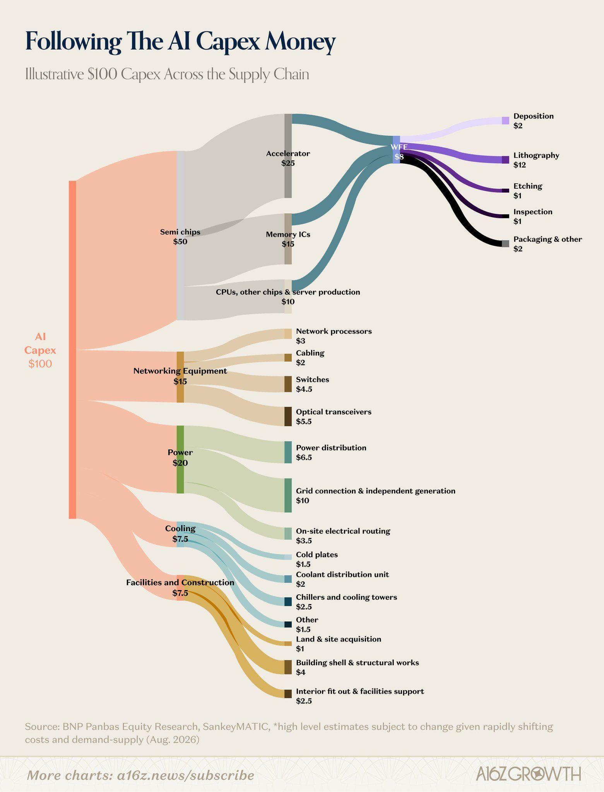
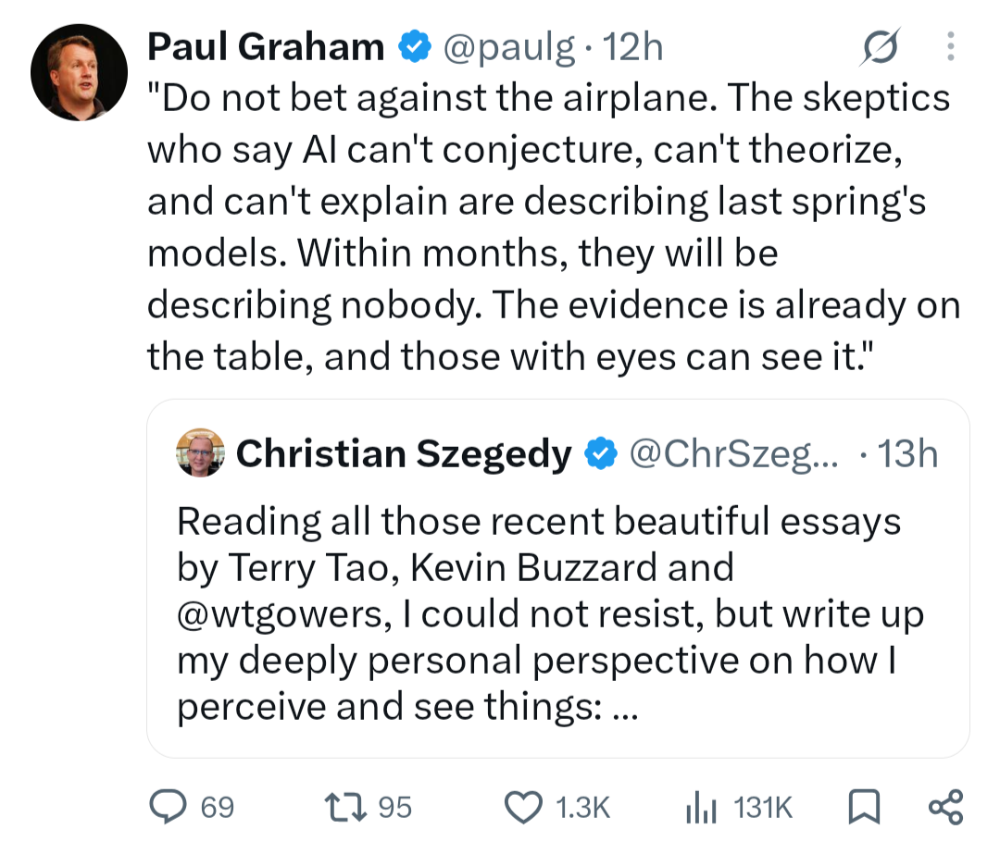
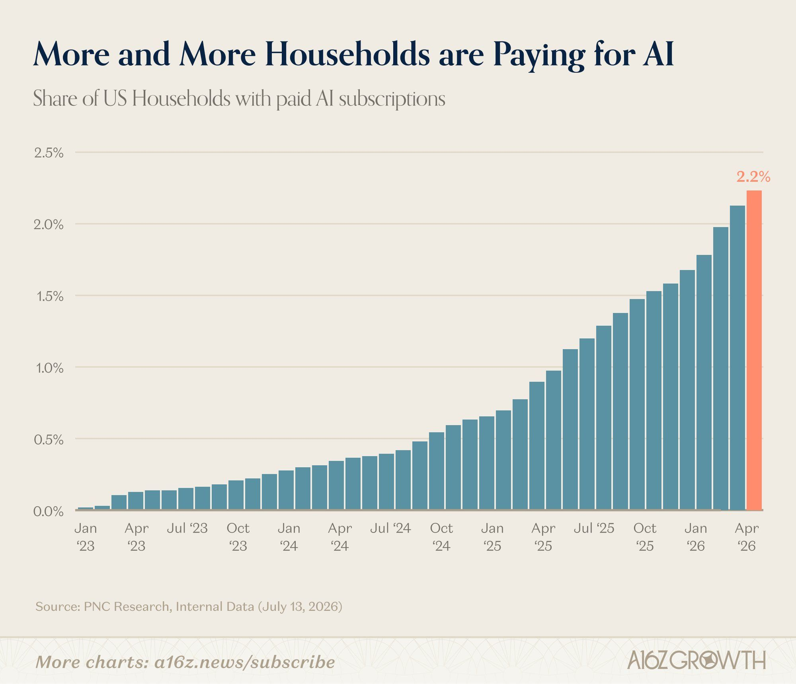

# October 2026

---

## 2026-10-02 evening BST — clipping: Goldman Sachs / US long-end treasuries “bidless” #macro #rates #treasuries

**Source:** Unverified social-media clip; pasted text shared by Luke (~2 Oct 2026 evening BST); X-style post; author/URL not provided; sensationalised claim — treat as unverified

> 🚨 GOLDMAN SACHS DROPS DOOMSDAY STATEMENT: U.S. BONDS HAVE NO BUYERS
>
> Goldman Sachs just admitted the long end of U.S. Treasury market is “totally bidless.”
>
> Translation: almost nobody wants the 10- to 30-year debt the U.S. is trying to sell.
>
> No buyers. None. Zero.
>
> While Treasury Secretary Scott Bessent tells Congress we’re in an “illiquid period,” doubles then triples long-bond buybacks, taps the General Treasury Account to fund it and openly says “I am the house.”
>
> Yields are surging anyway. The 10-year has pushed toward 5.3% and the 30-year is even higher, levels not seen in years while Japan, one of the biggest foreign holders, keeps selling Treasuries and bringing money home.
>
> This was exactly warned by Japan’s @yutokanzakireal that the measures being prepared by Bank of Japan will affect the lives of billions of people and apologized to people of the West. 
>
> Soon after, Scott Bessent intervened and effectively took over BoJ operations which Japanese policymakers heavily criticized.
>
> If the same ”bidless” condition hits the short-dated treasuries market, the entire U.S. debt market (and global) collapses.
>
> The U.S. debt crisis will turn into a global liquidity crisis.

---

## 2026-10-02 evening BST — clipping: François Chollet — base LLMs vs LRMs #ai #llm #arc

**Source:** Pasted social-media post attributed to François Chollet (~2 Oct 2026 evening BST); no URL given

> Chollet - The critical distinction between base LLMs (2024 and earlier) and modern LRMs is not symbolic tool use. It's the switch from a transductive paradigm (intuit the answer to the query) to an inductive paradigm (intuit the program/instructions that produce the answer to the query).
>
> They're trained to be inductive, and they perform test-time induction, i.e. test-time prediction of a NL program / reasoning chain. This unlocks entirely new capabilities -- in particular fluid intelligence. Base LLMs, to this day, have ~0 fluid intelligence. LRMs have substantial levels of fluid intelligence.
>
> The performance of LLMs on ARC 1 (a benchmark from 2019) remains ~10-15% today. Scaling them up by a factor ~100,000x got them from 0% to 10%. Meanwhile LRMs the same size or smaller saturated ARC 1 in 2025.

---

## 2026-10-02 evening BST — clipping: France sovereign debt / next euro crisis #macro #france #sovereign-debt #europe

**Source:** Pasted social-media post (~2 Oct 2026 evening BST); author/URL not given — treat as unverified opinion

> Most people don’t yet grasp what is happening in France. Markets are pricing French sovereign debt as junk, rating agencies will eventually have to follow. This will have two major impacts:
>
> 1. Most French banks are already rated at or just below the sovereign, so a move toward junk would likely drag domestically focused lenders with it. Credit to households and firms would slow sharply, hurting the economy and widening the fiscal deficit even further, a vicious cycle.
>
> 2. For the ECB, the constraint is legal as well as financial. A fall below investment grade would force sales by ratings-bound investors while making any backstop harder to justify under current rules.
>
> The next euro crisis will begin in France. The first, which began in Greece, will feel like a walk in the park compared with what comes next.

---

## 2026-10-02 evening BST — clipping: GPT-6 Astra — Napoleon general cipher (thread 1/6) #ai #agents #gpt6

**Source:** Pasted social-media post (thread opener, 1/6); author/URL not given; unverified claim

> I used GPT-6 Astra to break an unsolved cipher to one of Napoleon's generals that had gone unread for 217 years.
>
> What makes this impressive isn't actually the codebreaking, but that Astra completed the entire multi-modal workflow in ~6 hours from a single image and goal.
>
> 1/6🧵

---

## 2026-10-02 evening BST — clipping: a16z — AI buildout capex supply chain “State of Markets II” #ai #capex #semis #power

**Source:** a16z social post, “State of Markets II” (~2 Oct 2026 evening BST); link truncated as given: a16z.news/p/state-of-mar…

> A16z - Where does money invested into the AI buildout actually go?
>
> For every $100 flowing into the supply chain:
> - $50 to chips
> - $20 to power
> - $15 to networking
> - $15 to cooling, buildings, and land
>
> More charts in State of Markets II: a16z.news/p/state-of-mar…

**Chart:** Following The AI Capex Money, illustrative $100 split; source BNP Paribas Equity Research via a16z, Aug 2026

---

## 2026-10-04 morning BST — clipping: Paul Graham — do not bet against the airplane #ai #prediction

**Source:** X post by Paul Graham (@paulg); posted ~12 hours before screenshot (~2026-10-04 morning BST); quote-tweets Christian Szegedy (@ChrSzeg…); no URL given

> Do not bet against the airplane. The skeptics who say AI can't conjecture, can't theorize, and can't explain are describing last spring's models. Within months, they will be describing nobody. The evidence is already on the table, and those with eyes can see it.

Quote-tweeting Christian Szegedy (@ChrSzeg…): “Reading all those recent beautiful essays by Terry Tao, Kevin Buzzard and @wtgowers, I could not resist, but write up my deeply personal perspective on how I perceive and see things: ...”

Engagement at time of screenshot: 69 replies, 95 reposts, 1.3K likes, 131K views.

---

## 2026-10-04 morning BST — clipping: Christian Szegedy — Quo Vadis, Mathematics? #ai #maths #prediction

**Source:** “Quo Vadis, Mathematics? Is Mathematics Over, or Just Graduating?” by Christian Szegedy, 3 October 2026; published Google Doc; no URL given

Paul Graham’s quoted paragraph (“Do not bet against the airplane…”) is lifted verbatim from this essay’s “Quo Vadis?” section.

Szegedy frames his essay in four parts. **Graduation** recalls his teen competition-maths background and the emptiness after finals. **The Jungle** treats pure maths as an unmapped wilderness (maps = theories, mineral deposits = applications, gadgets = tools, rocks = conjectures). **The Airplane** compares AI to early aeroplanes: today it reaches a few unclimbed rocks (some conjectures); soon it will be cheap, “satellites” will map and mine the whole terrain, and maths will grow more useful and more mundane. **Quo Vadis** argues against betting on the airplane failing; status and rewards shift toward choosing terrain, steering fleets of airplanes, and explaining results — maths “graduating” into infrastructure for all science.

> Every revolution looks like a toy at first. The Wright brothers' first flight lasted twelve seconds and covered less distance than a jumbo jet's wingspan. That is roughly where AI stands in mathematics today.

> But the argument that airplanes can't reach the top of the real mountains (solve the hardest problems) or draw approximate maps of large areas (build theories) is a static-thinking fallacy. Today's airplanes are primitive compared to what they will be in a few months, let alone years.

> Once airplanes get cheap, we will also discover satellites. We will map the whole terrain for mineral deposits and other valuable resources, and then extract them.

> Mathematics is about to graduate. It will grow into a full-scale industry and become the true infrastructure of all scientific and technological progress, a foundation that every other field stands on rather than a quiet corner of academia. The age of lone climbers is closing, and the age of mapping the whole continent is opening.

---

## 2026-10-05 morning BST — clipping: Important advice — rethink how things should be done #ai #agents #prediction

**Source:** Pasted social-media post (X-style); author/URL not given

> Important advice: deliberately rethink every previous concept of how things should be done.
>
> Some thoughts, tips, and realizations:
>
> 1. Specializations are collapsing. Come to terms with and take advantage of this reality. The person who used to be an engineer is now also a data scientist, a content creator, designer, marketer, and whatever else they want to be. Deliberately expand in as many directions as you can and become great at them (scope up vs just speeding up)
>
> 2. The average person with access to tokens can now do the work of a data scientist who used to cost $500,000 a year. Seriously, this is fucking crazy. This opens up an entirely new world. Take advantage of it (also everyone else will also realize this over time).
>
> 3. 99% of what's created is now slop. Be aggressively anti-slop and you will absolutely stand out.
>
> 4. Trying is nearly free. Automating is nearly free. My mind still sometimes lives in the world from 12 months ago where an idea automatically is attached to a certain amount of time or effort. Both of these have collapsed to close to zero (or just token cost), I therefore try and experiment with *any and all* ideas with potential and have needed to retrain my brain for this constantly.
>
> 5. Tokens are a career and growth accelerant. Find ways to get cheap access to tokens, or free tokens. Extremely important, and actually an entire design space, use your imagination.
>
> 6. It's never been easier to both stand out but also fall behind. 10x, 100x "people" exist more than ever (maybe 1,000x). Outlier power users of AI, many who you see here on X. Feels like we are in a window of time, a window of opportunity while all of this is still early, to take advantage of it.
>
> 7. Local computing is (or will be) dead for 99% of work. Local was built for a world where work was bounded by the physical presence of its author, but this is no longer true. You can and should do infinite work in parallel or zero, it doesn't matter anymore. Cloud agents enable this at scale and in any computing environment, I predict cloud agent usage will 1000x over the next 12 months and optionality and accessibility will 100x. Plan for this world, take advantage of the possibilities.
>
> 8. Building on #7, you can give an agent it's own computer, and it's own identity. You can then give an agent with it's own computer it's own computer. You can give that agent with it's own computer with it's own computer, *it's* own computer. These agents are smarter than any human in history and you have access to as many as you'd like. Think about this for a moment.
>
> After 14 years in this industry (tech) today is the most exciting time ever and nothing else feels even close.

---

## 2026-10-05 morning BST — clipping: a16z Growth — US households paid AI subscriptions #ai #adoption #prediction

**Source:** a16z Growth chart via a16z.news (PNC Research, Internal Data, July 13, 2026)

**Chart:** "More and More Households are Paying for AI" — share of US households with paid AI subscriptions. April 2026 highlighted at **2.2%** (steep rise from ~0% Jan 2023).

---

## 2026-10-06 ~07:52 BST — clipping: Eric S Raymond — the end of software secrecy (LLM decompilation) #ai #software #open-source #saas #moats

**Source:** Eric S Raymond (ESR), two-part social post (X-style thread, 1/2 and 2/2); URL not given

> The end of software secrecy is almost upon us. The death of closed source, and the final triumph of open source.
>
> I should have realized this a few months ago when I successfully decompiled the game of Firefighter from an ancient DOS shareware binary. My robot friend was able to tell it had been written in Borland Pascal from looking at the data layout; it gave me back very readable Pascal code with sensibly chosen function and variable names. I transpiled it to Rust and now ship it as part of my heritage games collection. 
>
> The thing is, I thought of this as a fun stunt but didn't have any confidence that the technique would scale up to large, real programs. I have since learned that people are now doing this sort of thing with entire AAA games, which are among the most complex software artifacts ever to be shipped as a binary. If they can be decompiled, anything can be. 
>
> This has implications. Massive implications. We need to think about what the world is like when, in general, there is no longer a secrecy moat around almost any software at all.
>
> 1/2
>
> [continued]
>
> I say "almost" because there is going to be one way to maintain secrecy. Software as a service with the executable hiding behind a network connection to the cloud. But as of now, we must assume that anything shipped as an executable, or even a firmware image, is as transparent as glass. It won't keep its secrets for any longer than it takes for somebody to be motivated to throw an LLM at it.
>
> I did not see this coming. When I wrote down the theory of open source, 30 years ago now, I thought closed source would be gradually driven towards extinction by cost gradients, but survive indefinitely in certain niches. I did not foresee it being wiped out in a technoapocalypse.
>
> Ironically, I thought one of the application areas in which closed source would persist longest was games.
>
> There are still some obstacles. In US law, decompilation of a binary is a derivative work of the binary that falls under whatever copyright it had. However, it is also settled law that if you decompile binary code to a precise specification of what it does, then generate fresh code from that without looking at the decompiled stuff, you're in the clear. This was the case law that allowed PC clones to exist, after Phoenix Technologies reverse engineered the original IBM PC BIOS.
>
> The two-step process - binary to specification to unencumbered code - will no longer takes a large number of programmers and years of development time. With an LLM, it's now a thing you can do in a day. Ubiquity will make it impractical to prosecute all the people who might skip the specification step.
>
> Source code can also be covered by patents. You can be able to see their source code for a patented technique and not be able to use it without violating the law. Linux has evolved practices for dealing with this problem - one is not shipping patented video codecs, but requiring you to download them as plugins from jurisdictions where U.S. patents can't be enforced. This presents patent holders with the impractical challenge of individually suing millions of end users, assuming it can even figure out who they are. To date, AFAIK, this has not been attempted.
>
> And that's about it. If there are any other ways left to retain software secrecy and lock-in than SaaS or patents, I can't think of any. Well, you could epoxy-pot a firmware ROM, I suppose, but that can be defeated with a heat gun and a dental pick. Device manufacturers will learn not to pay for an assembly step that has become useless. 
>
> Forced migration from shipped binaries to tied cloud services will be tried - Adobe pioneered this, and Microsoft is pushing it as hard as they can given that their OS is a binary that has to run locally. Both companies are seeing massive user revolts over this. There is good reason to doubt that it's a strategy that can hold customers in the long term.
>
> Also, a lot of things can't safely be tied to the cloud at all, because they can't tolerate a random network outage. Machine tools, medical devices...
>
> A whole lot of proprietary software business models are going to collapse. Hard. One that I think might survive is tax software; being able to decompile it doesn't necessarily do you a lot of good because its actual value is tracking a ruleset that changes over time and has to be maintained by vendor specialists. But cases like this are unusual. 
>
> I think some dirty laundry is going to get aired, too. It has long been rumored that the reason graphics card manufacturers are so stubborn in their secrecy is that they've all been committing massive intellectual-property theft on each other for decades. If this is true, it will be exposed, and the lawsuits will be entertaining.
>
> We're entering a new world, with a lot of ancient comfortable assumptions being blown up. It's going to be fun to watch. 
>
> 2/2

---

## 2026-10-06 ~19:19 BST — clipping: Jack Farley / Mintzmyer — Hormuz VLCC rates ~25x; peak caution on tanker stocks #oil #shipping #tankers #drybulk #podcast

**Source:** Jack Farley podcast promo (X-style post, 1/3); guest J Mintzmyer (@mintzmyer). Partial Apple/Spotify/YouTube links as pasted (incomplete URLs OK)

> Jack Farley - OUT NOW - words like "crisis" or "historic" fail to describe the global oil tanker market right now, with daily tanker rates in/near the Strait of Hormuz up 25x. Not 25%. 25 TIMES.
>
> The Iran War has forced fleets to take ridiculous routes, with multiple ships running "relay races" and caused ton mile demand to explode higher. The typical daily rate for VLCC (Very Large Crude Carrier) is $40k and now there are VLCCs commanding over 1 MILLION PER DAY, an astronomical sum that reflects the extreme lengths oil refineries (especially those in Asia) are willing to go to get their supply.
>
> I am joined by J @mintzmyer, a shipping and energy specialist whose model portfolio for his research service is up ~3786% over the past decade (or ~40% annualized vs ~16% annualized for shipping industry). J was very bullish on oil and product tankers however, the madness is so extreme that he thinks rates have likely peaked and that investing in tanker stocks now could leave investors disappointed. Yes, earnings power will be phenomenal but tanker stocks (examples include Frontline, $ECO, $DHT, etc.) might have already priced that in. He does note however that what he is most bearish on is tanker RATES rather than tanker stocks; put simply, one million dollars a day cannot last.
>
> Where J is seeing real value is in drybulk stocks (transport of coal, iron ore, and aluminium ore ie bauxite), where giant aluminium/iron mines in West Africa are going to cause China to increase more bauxite imports from West Africa and less from Australia, which is going to cause a serious increase in demand for drybulk tonne miles. (Example of a dry bulk that could benefit from this trend is CMB.TECH) Plus, the new orders of drybulk that will come on the market is not large, where it IS for VLCCs and containerships.
>
> So often in covering markets, the thing that is the hottest topic is actually NOT the thing, meaning that the time that oil is at $120 is the time to sell your oil stocks, not buy them. Which is why I'm very happy to have J's note of caution on tanker stocks and tanker rates... BWET is up >4900% this year but buying it here might not be a good idea... in fact it could be cash incineration if normalization happens which history suggest will happen eventually.
>
> Apple
> podcasts.apple.com/us/podcast/the…
>
> Spotify
> open.spotify.com/episode/2uhMib…
>
> YouTube
> youtube.com/watch?v=aDQgZl…
>
> 1/3

---

## 2026-10-06 ~20:34 BST — clipping: Catalini — Anthropic as Pennsylvania Railroad; value in complements / verification #ai #moats #anthropic #gpt #verification

**Source:** Christian Catalini (@ccatalini), X self-thread posted 6 Oct 2026; most posts had charts (not attached). Includes early reply note from @realChiragh.

> Christian Catalini (@ccatalini), posted 6 October 2026. A self-thread arguing that Anthropic looks like a late-19th-century railroad: it built the tracks, but most of the surplus may not stay with the builder. Most posts have an attached chart or slide.
>
> 1. Is @AnthropicAI the Pennsylvania Railroad? It bought $7.33B of compute to carry $4.59B of revenue, ordered $518B more, and IPOs at peak utilization. In 1893 hundreds of railroads entered receivership. Society kept the tracks. Sears, the app layer, thrived.
>
> 2. Inventors’ predictions about the impact of their own technologies have a terrible record. Radio was going to end war. Nuclear power too cheap to meter. Film, flight, computers: the confident calls, utopian or dystopian, aged worst. Each one was sure “this time was different.”
>
> 3. Will one of the AI labs be the last company standing? No. Economic history is a graveyard of companies that built the future, then discovered they didn’t own it.
>
> 4. General purpose technologies (the original GPTs) are special. They span many sectors. Their quality-adjusted price keeps falling, unlocking new uses. The layers feed each other: a better GPT raises app productivity, and better apps raise the returns to the GPT.
>
> 5. Getting the full benefit means redesigning entire systems, not bolting on point solutions. GPTs also have weak appropriability. Nordhaus found innovators keep 2.2% of the surplus they create. GPT inventors likely keep less. The rest goes to the complements.
>
> 6. AI was born under a weak appropriability regime, like every GPT before it. There isn’t much the labs can do about it. Two outs: domains where a patent enforces excludability, like bio, or where customers pay a lot for a small edge, like finance, cyber, and defense.
>
> 7. Steam? Boulton & Watt held the patent. Cotton boomed. Electricity? A regulated utility. Factory labor productivity grew 5.1% a year. Combustion engines? Gasoline and suburbia.
>
> 8. Railroads had their own @DarioAmodei: Tom Scott, the “Pennsylvania Napoleon.” Standard Oil was most of his traffic. Scott moved into refining to capture value (labs and pharma?). After the price war the Pennsylvania paid Rockefeller 20c a barrel, even on his rivals’ crude.
>
> 9. Over 100 railways went into receivership. The tracks kept running. Without them, U.S. farmland would have been worth 60% less. Private return on the railroads: 3.5%. Social return: 48%. Value accrued to landowners, manufacturers, consumers. The app layer (Sears) boomed.
>
> 10. The market for intelligence splits three ways.
> Frontier generalists (closed) take the top of the demand curve.
> Low-cost generalists (open) run most tokens.
> Enterprises worried about disintermediation scale frontier specialists: open models plus proprietary context.
>
> 11. A frontier specialist starts with open weights, adds proprietary context, expert feedback and evals. In their domain, frontier specialists will beat closed labs on price and quality. Companies keep control, without funding or training their own replacement. Expect more of this.
>
> 12. The labs have one more problem: they need to be successful, but not too successful. The only company left in the world gets nationalized, or turned into a regulated utility, metered by the token.
>
> 13. So where does value ultimately accrue? To whoever holds the complementary assets: chips, the ability to turn atoms into datacenters, distribution, and reliable products customers and businesses pay for. The 2026 equivalents of farmland, factories and Sears.
>
> 14. Regulation could create one more complementary asset: permission to compete. If policy, safety and compliance costs become barriers to entry, the big labs get a real moat.
>
> 15. So how do you survive the moatpocalypse? Start from one observation: anything that can be measured will be automated.
>
> 16. Most of the scaling recipe to date is better measurement, not better models. Han & @dwarkesh_sp put 12x of pretraining progress down to better data and 3.7x to better models.
>
> 17. You can’t safely automate what you can’t reliably measure and verify. Verification means checking that the agent did what you intended. As execution gets cheaper, proving the task was done right becomes the bottleneck to safe scaling.
>
> 18. Which is why every company needs to become a verification factory. Two areas of focus: advance measurement through friction with the real world faster than your competitors, and recruit the best verifiers in your domain. (Quotes his 2 October thread, which opens with an expert rejecting a plausible but wrong answer — a controller catching deferred bookings counted as revenue, a security engineer blocking a release that would have given an agent write access to production.)
>
> 19. The only network effects that survive AI are verification-grade ones: the ones that benefit from the loop from new measurement and ground truth, to compute, to higher-quality verification that feeds back into new measurement.
>
> 20. Establishing verification-grade network effects is not enough. You also need to own the underlying loop to begin with. That means owning the weights of production.
>
> 21. But what about RSI? 26% of model R&D is now led by Claude, so progress is real. The last mile will stay a bottleneck. And more capable AI makes knowledge on the periphery worth more, not less. Which feeds back to the owners of complementary assets and context.
>
> 22. Hayek’s objection to central planning was never a shortage of compute. It was that the knowledge an economy runs on is tacit and tied to time and place. That holds for AI however capable it gets, which points to a world of many competing intelligences, not one company left.
>
> One early reply, from @realChiragh: the biggest winner of the AI revolution might not be the company building the intelligence infrastructure, but the company that figures out what to do with intelligence once it is abundant and cheap.

---
